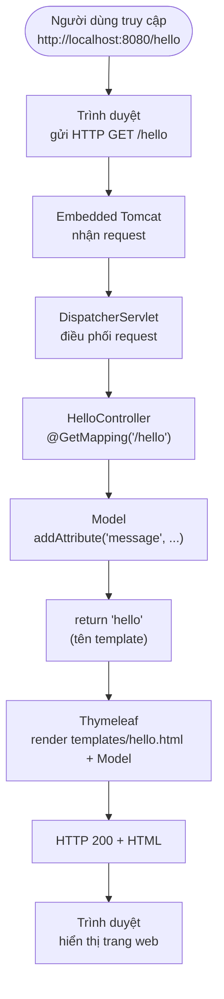

# Bài 4: Spring Boot cơ bản — Làm quen framework và xây dựng trang web với Thymeleaf

## Mục tiêu bài học

Sau bài này, học viên có thể:

- Giải thích Spring Boot là gì và khác Spring Framework ở điểm nào
- Tạo project trên start.spring.io, mở bằng IntelliJ và chạy ứng dụng
- Đọc được cấu trúc thư mục, `pom.xml`, `application.properties`
- Viết controller + trang Thymeleaf Hello World
- Phân biệt hai cách render Thymeleaf (`@Controller` vs `SpringTemplateEngine`) và biết chọn cách phù hợp

## Điều kiện tiên quyết

- Đã hoàn thành **Bài 3**: mô hình MVC — Model, View, Controller, Service, luồng request/response ([java_m2_bai3_MVC.md](java_m2_bai3_MVC.md))
- Biết Java cơ bản: class, package, annotation cơ bản
- Đã học HTML (cấu trúc trang web) — hiểu trình duyệt gửi request và nhận HTML
- Đã cài **JDK 17+** và **IntelliJ IDEA**

## Nội dung

| # | Chủ đề |
|---|--------|
| 1 | Khái niệm Framework |
| 2 | Tại sao chọn Spring Boot |
| 3 | Khởi tạo project |
| 4 | Khái niệm cơ bản trong project |
| 5 | Thực hành Hello World với Thymeleaf |
| 6 | Cách render Thymeleaf: `@Controller` vs `SpringTemplateEngine` |
| 7 | Lỗi thường gặp |
| Phụ lục | Dependencies phổ biến · Liên kết tham khảo |

---

## 1. Khái niệm về Framework

- **Framework** là tập hợp công cụ và thư viện được xây dựng sẵn. Ta thêm source code riêng để tạo ứng dụng.
- Framework cung cấp **cấu trúc**, **quy ước** và **tính năng** — giúp phát triển nhanh hơn so với viết mọi thứ từ đầu.

> **Ẩn dụ:** Framework giống khung nhà có sẵn ống nước, điện — bạn chỉ xây nội thất (code nghiệp vụ).

### 3 framework trọng tâm

| Framework | Vai trò | Liên kết |
|-----------|---------|----------|
| **Spring Boot** | Framework chính — web app, REST API, chạy bằng `main()` | [spring.io/projects/spring-boot](https://spring.io/projects/spring-boot) |
| **Spring Framework** | Nền tảng lõi (IoC, DI, MVC) — Spring Boot xây trên đây | [spring.io/projects/spring-framework](https://spring.io/projects/spring-framework) |
| **Hibernate** | ORM — ánh xạ Java ↔ database *(học ở bài sau)* | [hibernate.org](https://hibernate.org/) |

Trong khóa học, **Spring Boot** được chọn vì hệ sinh thái lớn, tài liệu phong phú và phù hợp phát triển ứng dụng web với Java.

<details>
<summary>Các Java framework khác (tham khảo — không trọng tâm bài này)</summary>

Quarkus, Micronaut, Jakarta EE, Play Framework, Vaadin, Dropwizard, Apache Struts — xem thêm tại [The Most Popular Java Frameworks in 2026](https://vaadin.com/blog/most-popular-java-frameworks-2026).

</details>

---

## 2. Tại sao lại chọn Spring Boot

**Spring Framework** là nền tảng cốt lõi. **Spring Boot** xây trên Spring Framework, bổ sung tự động cấu hình và công cụ khởi chạy nhanh.

### Thuật ngữ cơ bản

| Thuật ngữ | Giải thích ngắn |
|-----------|-----------------|
| **IoC** (Inversion of Control) | Spring quản lý object thay vì bạn `new` thủ công |
| **DI** (Dependency Injection) | Spring tự cấp object cần thiết vào class (`@Autowired`) |
| **MVC** | Model–View–Controller — tách logic, dữ liệu và giao diện |
| **AOP** | Lập trình hướng khía cạnh — *học ở module sau* |

### So sánh nhanh: Spring Framework vs Spring Boot

| Tiêu chí | Spring Framework | Spring Boot |
|----------|------------------|-------------|
| **Vai trò** | Framework lõi — IoC, DI, Spring MVC | Lớp trên — tự động cấu hình, khởi chạy nhanh |
| **Cấu hình** | Nhiều XML/Java config thủ công | **Autoconfiguration** theo dependency trong `pom.xml` |
| **Web server** | Deploy WAR lên Tomcat bên ngoài | **Embedded Tomcat** — chạy hàm `main()` |
| **Dependency** | Tự chọn từng thư viện | **Starter** — gói sẵn, version tương thích |
| **Khởi tạo project** | Tự dựng cấu trúc | [start.spring.io](https://start.spring.io/) |
| **Phù hợp khi** | Kiểm soát chi tiết từng thành phần | Phát triển nhanh web app / REST API |

**3 lý do chọn Spring Boot:**

1. **Autoconfiguration** — tự cấu hình Tomcat, MVC, Thymeleaf, …
2. **Starter** — ví dụ `spring-boot-starter-web` gồm Spring MVC + Tomcat + Jackson
3. **Embedded server** — không cần cài Tomcat riêng, chạy `main()` là có web server

> **Ghi nhớ:** Học Spring Boot vẫn là học Spring. Boot chỉ **bớt việc cấu hình**, không thay đổi cách viết logic.

> *Học sau:* Actuator (giám sát), profiles (`dev`/`prod`), triển khai microservices.

---

## 3. Khởi tạo Spring Boot project

### 3.1. Tạo project trên Spring Initializr

1. Truy cập [https://start.spring.io/](https://start.spring.io/)
2. Chọn các tùy chọn bên dưới
3. Click **Generate** → giải nén file `.zip`

**Các mục cần lựa chọn:**

| Mục | Gợi ý | Giải thích |
|-----|---------------|------------|
| **Project** | Maven | File cấu hình: `pom.xml` |
| **Language** | Java | |
| **Spring Boot** | Phiên bản ổn định mới nhất | |
| **Group** | `com.myapp` | Tên tổ chức — thường dùng domain ngược |
| **Artifact** | `demo` | Tên project / thư mục |
| **Package name** | `com.myapp.demo` | Package gốc chứa class `main` — **lưu ý kỹ** |
| **Packaging** | Jar | Ứng dụng độc lập, chạy bằng `main()` |
| **Java** | 17 hoặc 21 | Phải khớp JDK trên máy |
| **Dependencies** | **Spring Web**, **Thymeleaf** | Đủ cho bài Hello World |

> Xem thêm dependencies phổ biến tại **mục 4.3** hoặc [Phụ lục — Dependencies](#dependencies-phổ-biến).

### 3.2. Mở project bằng IntelliJ IDEA

1. **File → Open…** → chọn thư mục chứa `pom.xml` → **Open**
2. Chọn **Trust Project**
3. Kiểm tra JDK: **File → Project Structure → Project SDK** = **JDK 17+**
4. Đợi Maven download dependency (progress bar góc dưới)

```
src/main/java/com/myapp/demo/
└── DemoApplication.java          ← class chứa hàm main

src/main/resources/
└── application.properties
```

### 3.3. Run ứng dụng

1. Mở `DemoApplication.java`
2. Click **Run** (tam giác xanh) cạnh hàm `main`
3. Log thành công:

```
Started DemoApplication in 2.345 seconds
Tomcat started on port 8080 (http)
```

- Port mặc định: **8080** — đổi bằng `server.port=8081` trong `application.properties` nếu bị chiếm

### 3.4. Mở trình duyệt kiểm tra

1. Truy cập **http://localhost:8080**
2. Chưa có controller → **Whitelabel Error Page** — bình thường, server đã chạy
3. Sau khi làm mục 5 → truy cập **http://localhost:8080/hello**

**Dừng ứng dụng:** nút **Stop** (vuông đỏ) trên thanh Run.

---

## 4. Các khái niệm cơ bản trong project Spring Boot

> Nắm theo thứ tự: **cấu trúc thư mục → luồng request → Maven → package → annotation → Thymeleaf**.

### 4.1. Cấu trúc thư mục project

```
demo/
├── pom.xml
├── src/
│   ├── main/
│   │   ├── java/com/myapp/demo/
│   │   │   ├── DemoApplication.java      ← hàm main
│   │   │   └── controller/
│   │   │       └── HelloController.java
│   │   └── resources/
│   │       ├── application.properties
│   │       ├── static/                   ← CSS, JS, hình (URL: /css/...)
│   │       └── templates/                ← HTML Thymeleaf
│   └── test/java/
└── target/                               ← JAR build — không sửa tay
```

| Thư mục / file | Vai trò |
|----------------|---------|
| `src/main/java` | Code Java |
| `src/main/resources/templates` | View Thymeleaf |
| `src/main/resources/static` | File tĩnh — `/css/style.css` → `static/css/style.css` |
| `pom.xml` | Dependency + cấu hình Maven |
| `DemoApplication.java` | `@SpringBootApplication` + `main()` |

**Class khởi động:**

```java
@SpringBootApplication
public class DemoApplication {
    public static void main(String[] args) {
        SpringApplication.run(DemoApplication.class, args);
    }
}
```

- `@SpringBootApplication` — entry point, bật autoconfiguration, quét component trong **cùng package và package con**.
- `HelloController` phải nằm trong `com.myapp.demo.controller` — nếu không Spring **không tìm thấy**.

### 4.2. Luồng xử lý request (Spring MVC)

Kết nối với bài HTML: trình duyệt gửi HTTP request → server xử lý → trả HTML về trình duyệt.



**Tóm tắt luồng:**

```
Request:  Trình duyệt → Tomcat → DispatcherServlet → Controller → return "hello"
Response: Thymeleaf (render HTML) → DispatcherServlet → Tomcat → Trình duyệt
```

### 4.3. Maven & Dependency

- **Maven** — quản lý thư viện và build project; cấu hình trong `pom.xml`.
- **Dependency** — thư viện bên ngoài (Spring MVC, Thymeleaf, …).
- **Starter** — gói dependency do Spring Boot đóng sẵn, version tương thích.

**Vòng đời Maven (hay dùng):** `compile` → `test` → `package` → `install`

**Ví dụ `pom.xml`:**

```xml
<dependencies>
    <dependency>
        <groupId>org.springframework.boot</groupId>
        <artifactId>spring-boot-starter-web</artifactId>
    </dependency>
    <dependency>
        <groupId>org.springframework.boot</groupId>
        <artifactId>spring-boot-starter-thymeleaf</artifactId>
    </dependency>
</dependencies>
```

| Tên trên start.spring.io | Artifact trong `pom.xml` |
|--------------------------|--------------------------|
| Spring Web | `spring-boot-starter-web` |
| Thymeleaf | `spring-boot-starter-thymeleaf` |

**Thêm dependency sau:** copy block `<dependency>` vào `pom.xml` → chuột phải `pom.xml` → **Maven → Reload project**.

Tham khảo: [Spring Boot Dependencies — MVN Repository](https://mvnrepository.com/artifact/org.springframework.boot/spring-boot-dependencies/3.5.3)

### 4.4. Package

- **Package** nhóm class theo chức năng — tương ứng thư mục trong `src/main/java`.

**Cấu trúc cơ bản (Hello World):**

```
com.myapp.demo/
├── DemoApplication.java
└── controller/
    └── HelloController.java
```

<details>
<summary>Kiến trúc phân lớp — đã học ở Bài 3</summary>

Xem chi tiết tại [Bài 3 — Kiến trúc phân lớp](java_m2_bai3_MVC.md#7-kiến-trúc-phân-lớp-trong-spring-boot).

| Layer | Package | Vai trò |
|-------|---------|---------|
| Controller | `…controller` | Nhận HTTP request |
| Service | `…service` | Logic nghiệp vụ |
| Repository | `…repository` | Giao tiếp database |
| Model | `…model` | Class dữ liệu |

```
Browser → Controller → Service → Repository → Database
                ↓
            Thymeleaf / JSON
```

</details>

### 4.5. Properties file

File **`.properties`** (hoặc **`.yml`**) — cấu hình tách khỏi code.

**Cấu hình cơ bản:**

```properties
server.port=8080
spring.application.name=demo-app
```

<details>
<summary>Profiles theo môi trường — học sau</summary>

| File | Môi trường |
|------|------------|
| `application.properties` | Mặc định |
| `application-dev.properties` | Dev |
| `application-prod.properties` | Production |

Kích hoạt: `spring.profiles.active=dev`

</details>

### 4.6. Annotation & Bean

- **Bean** — object do Spring tạo và quản lý (controller, service, …).
- **DI** — Spring inject bean qua `@Autowired` thay vì `new` thủ công.

| Annotation | Mô tả |
|------------|-------|
| `@SpringBootApplication` | Entry point + autoconfiguration |
| `@Controller` | Trả **view HTML** (Thymeleaf) |
| `@RestController` | Trả **JSON** — dùng cho REST API *(bài sau)* |
| `@GetMapping("/path")` | Xử lý HTTP GET |
| `@Autowired` | Inject dependency |
| `@Service`, `@Repository` | Bean theo vai trò *(bài sau)* |

> **Ghi nhớ:** Thymeleaf → `@Controller` + `return "hello"`. REST API → `@RestController`.

> `@RequestParam`, `@PathVariable` — lấy tham số URL *(demo ở bài sau)*.

### 4.7. Thymeleaf

Template engine render HTML phía server — tách view khỏi controller.

**3 bước:**

1. Dependency `spring-boot-starter-thymeleaf`
2. File HTML trong `src/main/resources/templates/`
3. Controller trả tên template (không kèm `.html`)

```java
@Controller
public class HelloController {

    @GetMapping("/hello")
    public String hello(Model model) {
        model.addAttribute("message", "Hello, World!");
        return "hello";   // → templates/hello.html
    }
}
```

```html
<p th:text="${message}">Placeholder</p>
```

| Cú pháp | Ý nghĩa |
|---------|---------|
| `th:text="${message}"` | Hiển thị biến |
| `th:href="@{/users}"` | Link URL |
| `th:each="item : ${items}"` | Lặp danh sách *(bài sau)* |

**Quy ước:** URL `/hello`, template `hello.html`, `return "hello"` — **ba thứ độc lập**, có thể đặt tên khác nhau.

> Ngoài cách trên còn có cách render thủ công bằng `SpringTemplateEngine` — so sánh chi tiết tại **mục 6**.

---

## 5. Thực hành Hello World

### Yêu cầu

1. Tạo project Spring Boot — có thể đặt **Artifact** theo tên học viên (vd: `nguyenvana`)
2. Trang Hello World bằng Thymeleaf, có **dữ liệu động** từ controller
3. Truy cập được trên trình duyệt qua URL mapping

> **Lưu ý đặt tên:** Ví dụ trong tài liệu dùng `demo` / `DemoApplication`. Nếu đổi Artifact, cần cập nhật **Package name**, tên class `*Application` và package trong code cho **khớp nhau** — nếu không controller có thể không được Spring quét.

### Các bước thực hiện

1. Tạo project trên [start.spring.io](https://start.spring.io/) — chọn **Spring Web**, **Thymeleaf** (mục 3.1)
2. Mở project bằng IntelliJ, kiểm tra JDK (mục 3.2)
3. Chuột phải package gốc (vd: `com.myapp.demo`) → **New → Package** → nhập `controller`
4. Chuột phải package `controller` → **New → Java Class** → `HelloController`
5. Chuột phải `src/main/resources` → **New → Directory** → `templates` (nếu chưa có)
6. Chuột phải `templates` → **New → File** → `hello.html`
7. Viết code controller và HTML (mẫu bên dưới)
8. Run `DemoApplication.java` → mở **http://localhost:8080/hello**

### Cấu trúc project

```
src/main/java/com/myapp/demo/
├── DemoApplication.java
└── controller/
    └── HelloController.java

src/main/resources/templates/
└── hello.html
```

### HelloController.java

```java
package com.myapp.demo.controller;

import org.springframework.stereotype.Controller;
import org.springframework.ui.Model;
import org.springframework.web.bind.annotation.GetMapping;

@Controller
public class HelloController {

    @GetMapping("/hello")
    public String hello(Model model) {
        model.addAttribute("title", "Thymeleaf Hello World");
        model.addAttribute("studentName", "Nguyễn Văn A");   // đổi thành tên bạn
        model.addAttribute("message", "Xin chào từ Spring Boot!");
        return "hello";
    }
}
```

> Nếu thiếu import, đặt con trỏ vào class đỏ → **Alt + Enter** (Windows/Linux) hoặc **Option + Enter** (macOS) để IntelliJ tự thêm.

### hello.html

```html
<!DOCTYPE html>
<html lang="vi" xmlns:th="http://www.thymeleaf.org">
<head>
    <meta charset="UTF-8"/>
    <title th:text="${title}">Hello</title>
</head>
<body>
    <h1 th:text="${title}">Thymeleaf Hello World</h1>
    <p>Xin chào, <strong th:text="${studentName}">Tên</strong>!</p>
    <p th:text="${message}">Message</p>
</body>
</html>
```

### Chạy và kiểm tra

1. Run `DemoApplication.java`
2. Mở **http://localhost:8080/hello**
3. Kiểm tra tên và message hiển thị đúng

### Bài mở rộng *(tuỳ chọn)*

- Redirect trang chủ: `@GetMapping("/")` + `return "redirect:/hello";`
- Thêm file CSS trong `static/css/style.css` và link vào `hello.html`
- Hiển thị thời gian: `model.addAttribute("now", LocalDateTime.now())` + `th:text="${now}"` *(cần `import java.time.LocalDateTime`)*

---

## 6. Cách render Thymeleaf: `@Controller` vs `SpringTemplateEngine`

Sau khi làm Hello World (mục 5), ta đã dùng **Cách 1**: `@Controller` + `return "hello"` — Spring MVC tự render template. Ngoài ra còn **Cách 2**: inject `SpringTemplateEngine` và gọi `templateEngine.process(...)` để tự render HTML trong code.

> **Mục tiêu mục này:** Hiểu cả hai cách, biết vì sao Cách 1 là chuẩn cho trang web, và khi nào Cách 2 mới phù hợp trong môi trường doanh nghiệp.

### 6.1. Cách 1 — `@Controller` + tên view

*(Đã thực hành ở mục 4.7 và 5.)*

```java
@Controller
public class HelloController {

    @GetMapping("/hello")
    public String hello(Model model) {
        model.addAttribute("message", "Hello, World!");
        return "hello";   // Spring MVC + ThymeleafViewResolver render templates/hello.html
    }
}
```

Controller chỉ trả **tên view logic**; framework lo phần render.

### 6.2. Cách 2 — `SpringTemplateEngine.process()` *(render thủ công)*

```java
@RestController
public class HelloController {

    private final SpringTemplateEngine templateEngine;

    public HelloController(SpringTemplateEngine templateEngine) {
        this.templateEngine = templateEngine;
    }

    @GetMapping(value = "/hello", produces = MediaType.TEXT_HTML_VALUE)
    public String pageHello() {
        Context context = new Context();
        context.setVariable("message", "Hello, World!");
        return templateEngine.process("hello", context);   // trả chuỗi HTML đã render
    }
}
```

Developer **tự tạo `Context`**, gọi engine và trả **chuỗi HTML** — không qua cơ chế ViewResolver của Spring MVC.

### 6.3. So sánh hai cách

| Tiêu chí | Cách 1: `@Controller` + `return "hello"` | Cách 2: `SpringTemplateEngine.process()` |
|----------|------------------------------------------|------------------------------------------|
| **Annotation** | `@Controller` | Thường kèm `@RestController` |
| **Kết quả trả về** | Tên view logic (`"hello"`) | Chuỗi HTML đã render |
| **Ai render HTML?** | Spring MVC + `ThymeleafViewResolver` | Developer gọi engine trực tiếp |
| **Truyền dữ liệu** | `Model`, `ModelAndView` | `Context` + `setVariable()` |
| **Tích hợp Spring MVC** | Đầy đủ | Bỏ qua ViewResolver |
| **Phù hợp** | Trang web SSR (Server-Side Rendering) | Email, báo cáo, job nền — *không phải HTTP page thông thường* |

### 6.4. Tại sao không nên dùng Cách 2 cho trang web?

Cách 2 **vẫn chạy được** trên trình duyệt, nhưng **không phải pattern chuẩn** khi build trang web Thymeleaf trong Spring Boot:

| # | Lý do |
|---|--------|
| 1 | **Sai abstraction** — Controller không nên biết chi tiết engine render; vi phạm tách lớp |
| 2 | **Dùng nhầm `@RestController`** — Coi HTML như response body thô, bỏ qua cơ chế ViewResolver của Spring MVC |
| 3 | **Mất tính năng MVC** — `redirect:`, `forward:`, flash attributes, locale/theme resolver khó dùng hoặc không hoạt động đúng |
| 4 | **Khó bảo trì** — Mỗi controller tự `new Context()`, `setVariable()` — boilerplate, không thống nhất |
| 5 | **Khó test chuẩn** — Enterprise test `@Controller` bằng `MockMvc` + assert view name; cách thủ công phải assert chuỗi HTML |
| 6 | **Dễ nhầm với REST API** — Học viên mới khó phân biệt khi nào dùng `@Controller` vs `@RestController` |
| 7 | **Không phải convention Spring Boot** — Code review / onboarding team sẽ yêu cầu sửa lại |

### 6.5. Enterprise best practice — trang web Thymeleaf

```java
@Controller
@RequestMapping("/students")
public class StudentController {

    private final StudentService studentService;

    public StudentController(StudentService studentService) {
        this.studentService = studentService;   // constructor injection — chuẩn enterprise
    }

    @GetMapping("/{id}")
    public String detail(@PathVariable Long id, Model model) {
        model.addAttribute("student", studentService.findById(id));
        return "students/detail";   // → templates/students/detail.html
    }

    @PostMapping
    public String create(@Valid @ModelAttribute("form") StudentForm form,
                         BindingResult result) {
        if (result.hasErrors()) {
            return "students/form";            // quay lại form khi lỗi validation
        }
        studentService.save(form);
        return "redirect:/students";           // Post-Redirect-Get pattern
    }
}
```

**Nguyên tắc khi đi làm:**

| Nguyên tắc | Giải thích |
|------------|------------|
| **`@Controller` cho HTML** | Trang Thymeleaf luôn dùng `@Controller`, không dùng `@RestController` |
| **`@RestController` cho API** | Trả JSON cho frontend SPA / mobile — tách biệt với SSR |
| **Trả tên view, không render tay** | `return "folder/view"` — để Spring MVC + ThymeleafViewResolver xử lý |
| **Constructor injection** | Ưu tiên inject qua constructor thay vì `@Autowired` trên field |
| **Không trả Entity ra view** | Dùng DTO / ViewModel — tránh lộ cấu trúc DB, tránh lazy-loading lỗi |
| **Tách layer** | Controller chỉ điều phối; logic nằm ở Service |
| **`redirect:` sau POST** | Tránh submit lại form khi F5 (Post-Redirect-Get) |
| **Validation** | `@Valid` + `BindingResult` trên form HTML |

**Luồng chuẩn trong doanh nghiệp:**

```
HTTP Request
    → DispatcherServlet
    → @Controller method
    → Service (business logic)
    → Model (dữ liệu cho view)
    → return "view-name"
    → ThymeleafViewResolver + SpringTemplateEngine (Spring tự gọi — không cần inject trong controller)
    → HTML response
```

> **Lưu ý:** `SpringTemplateEngine` **vẫn được dùng** trong ứng dụng enterprise — nhưng do **framework gọi ngầm** qua ViewResolver, không phải do controller gọi `process()` cho từng trang web.

### 6.6. Khi nào Cách 2 (`process()`) hợp lệ?

`templateEngine.process()` **hợp lệ** khi output **không đi qua HTTP view resolver**:

| Use case | Ví dụ |
|----------|--------|
| **Email** | Render template HTML gửi qua JavaMail / notification service |
| **Báo cáo / export** | Sinh HTML/PDF offline trong batch job |
| **Scheduled task** | Job định kỳ tạo nội dung từ template |
| **Test unit** | Kiểm tra nội dung template mà không khởi động web server |

```java
@Service
public class EmailService {

    private final SpringTemplateEngine templateEngine;
    private final JavaMailSender mailSender;

    public void sendWelcomeEmail(User user) {
        Context context = new Context();
        context.setVariable("userName", user.getName());
        String html = templateEngine.process("emails/welcome", context);

        // gửi email với html — không phải HTTP response
        mailSender.send(buildMessage(user.getEmail(), html));
    }
}
```

### 6.7. Tóm tắt — chọn cách nào?

| Mục đích | Cách dùng |
|----------|-----------|
| Trang web Thymeleaf (SSR) | `@Controller` + `Model` + `return "view-name"` |
| REST API (JSON) | `@RestController` + return object/DTO |
| Email / báo cáo / job nền | `SpringTemplateEngine.process()` trong **Service** |

---

## 7. Lỗi thường gặp

| Triệu chứng | Nguyên nhân | Cách xử lý |
|-------------|-------------|------------|
| **404 Not Found** | URL sai / chưa mapping | Kiểm tra `@GetMapping("/hello")` và URL trình duyệt |
| **Whitelabel Error Page** | Server chạy, chưa có route `/` | Bình thường — truy cập `/hello` |
| **Controller không chạy** | Ngoài package scan | Controller phải trong package con của `*Application` |
| **Template not found** | Sai tên / sai thư mục | `templates/hello.html` ↔ `return "hello"` |
| **500 Internal Server Error** | Lỗi code hoặc Thymeleaf | Kiểm tra tên biến `${...}` khớp `model.addAttribute(...)` |
| **Port 8080 in use** | Port bị chiếm | `server.port=8081` |
| **Cannot resolve symbol** | Maven chưa reload | `pom.xml` → Maven → Reload project |
| **Sửa code không thấy đổi** | Ứng dụng đang chạy bản cũ | **Stop** → **Run** lại `*Application.java` |
| **JDK mismatch** | SDK project ≠ máy | File → Project Structure → JDK 17+ |

---

## Tóm tắt

| Khái niệm | Ý chính |
|-----------|---------|
| **Framework / Spring Boot** | Bộ công cụ có sẵn; Boot = Spring + tự cấu hình + embedded server |
| **Luồng request** | Browser → Tomcat → DispatcherServlet → Controller → Thymeleaf → HTML |
| **Maven / Starter** | `pom.xml` quản lý thư viện; starter = gói tương thích |
| **Bean / @Autowired** | Spring tạo và inject object |
| **@Controller + Model** | Trả view Thymeleaf — chuẩn cho trang web SSR |
| **Thymeleaf** | `th:text="${var}"` — dữ liệu động từ controller |
| **Hai cách render** | Trang web → Cách 1 (`@Controller`); email/job → `process()` trong Service |

---

## Phụ lục

### Dependencies phổ biến

| Dependency | Tóm tắt |
|------------|---------|
| Spring Web | Web app, REST API, embedded Tomcat |
| Thymeleaf | Render HTML từ server |
| Spring Data JPA | Database SQL qua Hibernate |
| Spring Data MongoDB | Database NoSQL |
| Spring Security | Xác thực, phân quyền |
| DevTools | Tự reload khi dev |
| Lombok | Giảm boilerplate getter/setter |
| Validation | `@NotNull`, `@Size`, … |
| Actuator | Health check, metrics |
| H2 Database | DB in-memory để thử nhanh |

### Liên kết tham khảo

- [Spring Initializr](https://start.spring.io/)
- [Spring Boot Documentation](https://docs.spring.io/spring-boot/index.html)
- [Thymeleaf + Spring](https://www.thymeleaf.org/doc/tutorials/3.1/thymeleafspring.html)
- [MVN Repository — Spring Boot Dependencies](https://mvnrepository.com/artifact/org.springframework.boot/spring-boot-dependencies/3.5.3)
