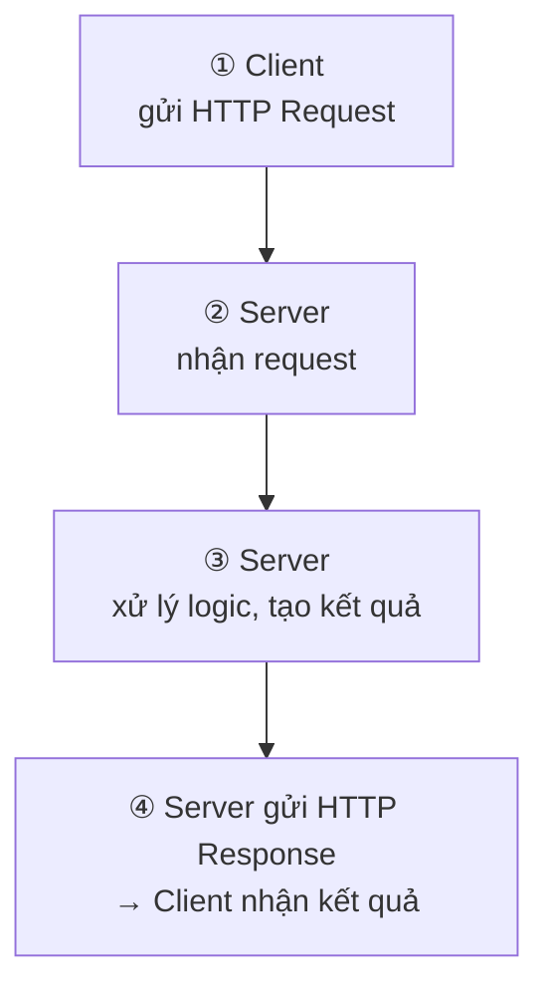
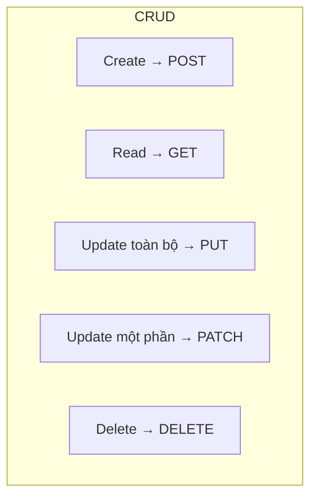
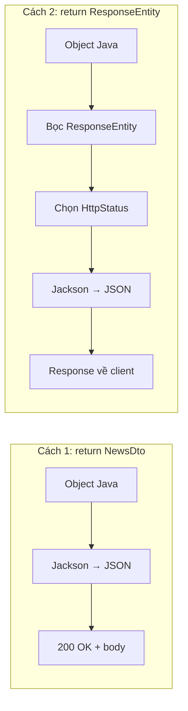
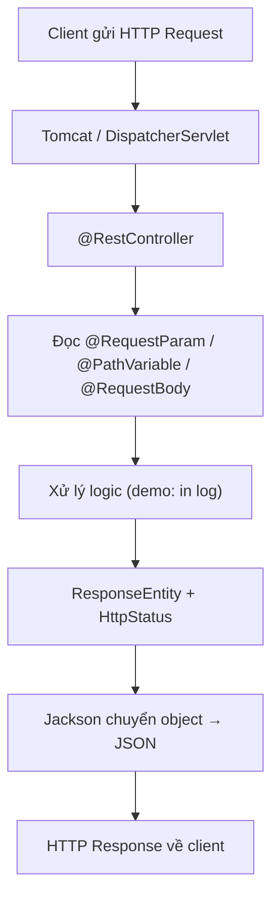

# Bài 5: Spring Boot MVC (part 1) — Xây dựng REST API với Spring Boot

## Mục tiêu bài học

Sau bài này, học viên có thể:

- Giải thích Web Service, REST và RESTful API
- Phân biệt `@Controller` (trả HTML) và `@RestController` (trả JSON)
- Đặt tên URL API theo quy ước RESTful
- Tạo API với 5 HTTP method: GET, POST, PUT, PATCH, DELETE
- Nhận tham số qua `@RequestParam` (bắt buộc / không bắt buộc), `@PathVariable`, `@RequestBody`
- Trả response với `ResponseEntity` và HTTP status code phù hợp
- Test API bằng Postman

## Điều kiện tiên quyết

- Đã hoàn thành **Bài 4**: Spring Boot project, `@Controller`, Thymeleaf
- Biết Java cơ bản: class, package, annotation, getter/setter
- Project có dependency **`spring-boot-starter-web`**
- Đã cài **Postman**: [postman.com/downloads](https://www.postman.com/downloads/)

> **Ghi chú:** Phần 1 tập trung vào **Controller layer** trong mô hình MVC — cụ thể là xây dựng **REST API** (trả JSON) bằng `@RestController`. Phần View (Thymeleaf) đã học ở Bài 4.

## Nội dung

| # | Chủ đề |
|---|--------|
| 1 | Web Service là gì? |
| 2 | REST vs RESTful |
| 3 | HTTP Methods & CRUD mapping |
| 4 | `@RestController` vs `@Controller` |
| 5 | Quy ước đặt tên API (API Naming) |
| 6 | Cài đặt Postman & kiểm tra API |
| 7 | GET API |
| 8 | POST API |
| 9 | PUT API |
| 10 | PATCH API |
| 11 | DELETE API |
| 12 | HTTP Status Codes |
| 13 | Lỗi thường gặp |
| Phụ lục | Bài tập tổng hợp · Liên kết tham khảo |

---

## 1. Web Service là gì?

- **Web Service** là tập hợp các giao thức và tiêu chuẩn để trao đổi dữ liệu giữa các ứng dụng hoặc hệ thống thông qua **API** (Application Programming Interface).
- Web Service **không phụ thuộc ngôn ngữ lập trình** — ứng dụng Java có thể giao tiếp với ứng dụng Python, mobile app, hoặc frontend React.



| Bước | Ai | Làm gì |
|------|-----|--------|
| ① | **Client** (app mobile, website, phần mềm khác) | Gửi **HTTP Request** tới server (URL, method GET/POST/…, dữ liệu kèm theo nếu có) |
| ② | **Server** | Nhận và phân tích request |
| ③ | **Server** | Xử lý logic nghiệp vụ — đọc/ghi dữ liệu, tính toán, … |
| ④ | **Server → Client** | Gửi **HTTP Response** (mã trạng thái + dữ liệu trả về, thường là JSON) |

> Server có thể được viết bằng **Java, Python, Node.js, …** — Web Service không gắn với một framework cụ thể. Trong khóa học này, ta sẽ dùng **Spring Boot** để xây dựng phía server.

**Ví dụ thực tế:**

| Client | Gọi API | Nhận về |
|--------|---------|---------|
| App mobile | `GET /api/v1/products` | Danh sách sản phẩm (JSON) |
| Website React | `POST /api/v1/orders` | Đơn hàng vừa tạo (JSON) |
| Hệ thống nội bộ | `DELETE /api/v1/users/5` | Xác nhận đã xóa |

---

## 2. REST vs RESTful

Hai thuật ngữ thường được dùng lẫn nhau nhưng **không hoàn toàn giống nhau**.

| Khái niệm | Định nghĩa |
|-----------|------------|
| **REST** | Kiến trúc (architectural style) do Roy Fielding đề xuất — tập **nguyên tắc thiết kế** hệ thống phân tán qua HTTP |
| **RESTful** | Mô tả **mức độ tuân thủ** các nguyên tắc REST của một API hoặc web service |

> **Ẩn dụ:** REST là "luật giao thông"; RESTful là "lái xe có tuân luật hay không" — API có thể *gần RESTful* chứ hiếm khi đạt 100%.

### So sánh nhanh

| Tiêu chí | REST (nguyên tắc) | RESTful API (thực hành) |
|----------|-------------------|-------------------------|
| Bản chất | Tư tưởng thiết kế | Cách triển khai API theo tư tưởng đó |
| Trọng tâm | Resource, stateless, uniform interface | URL, HTTP method, status code, JSON |
| Ví dụ | "Mọi thứ là tài nguyên, dùng HTTP chuẩn" | `GET /api/v1/products/5` trả JSON `200` |

### 6 nguyên tắc REST (overview)

| # | Nguyên tắc | Giải thích ngắn |
|---|------------|-----------------|
| 1 | **Client–Server** | Tách UI và xử lý dữ liệu |
| 2 | **Stateless** | Mỗi request đủ thông tin; server không "nhớ" session client |
| 3 | **Cacheable** | Response có thể cache (thường với GET) |
| 4 | **Uniform Interface** | URL + HTTP method thống nhất |
| 5 | **Layered System** | Client không cần biết server trung gian |
| 6 | **Code on Demand** *(tùy chọn)* | Ít gặp trong API thuần JSON |

---

## 3. HTTP Methods & CRUD mapping

CRUD là 4 thao tác cơ bản trên dữ liệu: **C**reate, **R**ead, **U**pdate, **D**elete.

| Thao tác | HTTP Method | Mô tả |
|----------|-------------|-------|
| **Create** | POST | Tạo tài nguyên mới |
| **Read** | GET | Đọc / lấy dữ liệu |
| **Update (toàn bộ)** | PUT | Thay thế toàn bộ tài nguyên |
| **Update (một phần)** | PATCH | Cập nhật một hoặc vài field |
| **Delete** | DELETE | Xóa tài nguyên |



> **Ghi nhớ:** Hành động thể hiện qua **HTTP method**, không đặt động từ trong URL (`/create`, `/delete`, `/getAll`).

---

## 4. `@RestController` vs `@Controller`

Ở Bài 4, ta dùng `@Controller` để trả **trang HTML** (Thymeleaf). Bài này dùng `@RestController` để trả **JSON**.

| Annotation | Trả về | Content-Type | Dùng khi |
|------------|--------|--------------|----------|
| `@Controller` | Tên view (`"hello"`) → HTML | `text/html` | Trang web SSR (Thymeleaf) |
| `@RestController` | Object / DTO → JSON | `application/json` | REST API cho mobile, SPA, hệ thống khác |

`@RestController` = `@Controller` + `@ResponseBody` — Spring tự chuyển object Java thành JSON (nhờ **Jackson**, có sẵn trong `spring-boot-starter-web`).

**Ví dụ `@RestController`:**

```java
package vn.demo.get.controller;

import org.springframework.web.bind.annotation.GetMapping;
import org.springframework.web.bind.annotation.RestController;

@RestController
public class ProductQueryController {

    @GetMapping("/api/v1/products")
    public String hello() {
        return "Hello API";
    }
}
```

### Cấu trúc package gợi ý

Demo bài này chia package **theo HTTP method** — mỗi method một package, tự chứa `controller` + `dto`. Nhìn tên package biết ngay đang học method nào:

```
vn.demo/
├── DemoApplication.java
├── get/                              ← §7 GET API
│   ├── controller/
│   │   ├── ProductQueryController.java
│   │   ├── NewsController.java
│   │   └── UserQueryController.java
│   └── dto/NewsDto.java
├── post/                             ← §8 POST API
│   ├── controller/{ProductCreateController, CategoryCreateController}.java
│   └── dto/{ProductRequest, GameCreateRequest}.java
├── put/                              ← §9 PUT API
│   ├── controller/{CategoryUpdateController, UserUpdateController}.java
│   └── dto/{CategoryRequest, UserProfileRequest}.java
├── patch/                            ← §10 PATCH API
│   ├── controller/{ProductPatchController, UserPatchController}.java
│   └── dto/{ProductPatchRequest, UserPatchRequest}.java
├── delete/                           ← §11 DELETE API
│   └── controller/{OrderController, SongController}.java
└── capstone/                         ← Phụ lục: Bài tập tổng hợp (books)
    ├── controller/BookController.java
    ├── dto/{BookRequest, BookPatchRequest}.java
    ├── model/Book.java
    └── service/BookService.java
```

> **Quy ước:** Tách class nhận dữ liệu từ client vào package `dto` (Data Transfer Object). Mỗi package method tự chứa `controller` + `dto` riêng để không phụ thuộc chéo.

---

## 5. Quy ước đặt tên API (API Naming)

Đặt tên URL đúng giúp API dễ đọc, dễ bảo trì và gần chuẩn RESTful.

### 5.1. Quy tắc cốt lõi

| # | Quy tắc | Ví dụ đúng | Ví dụ sai |
|---|---------|------------|-----------|
| 1 | Dùng **danh từ**, không dùng động từ | `/products` | `/getProducts` |
| 2 | Dùng **số nhiều** cho collection | `/users` | `/user` |
| 3 | Phân cấp bằng `/` | `/orders/12/items` | `/orders_12_items` |
| 4 | **Chữ thường**, dùng `-` nếu nhiều từ | `/product-categories` | `/ProductCategories` |
| 5 | Hành động qua **HTTP method** | `DELETE /products/5` | `/deleteProduct/5` |
| 6 | Version API (khuyến nghị) | `/api/v1/products` | `/products` *(chấp nhận được khi học)* |
| 7 | Lọc / phân trang qua **query string** | `/products?category=phone` | `/products/phone` *(khi phone là filter)* |

### 5.2. Prefix `/api`

| Pattern | Ý nghĩa | Ví dụ |
|---------|---------|-------|
| `/api/...` | REST API trả JSON | `/api/v1/products` |
| Không prefix | Trang web / static (Bài 4) | `/hello`, `/home` |
| `/api/v1/...` | Version hóa API | `/api/v1/products` |

Trong bài này, thống nhất dùng: **`/api/v1/{resource}`**.

### 5.3. Bảng ánh xạ CRUD → URL + Method

Resource: **products**

| Hành động | Method | URL | Body | Status gợi ý |
|-----------|--------|-----|------|--------------|
| Lấy danh sách | GET | `/api/v1/products` | — | 200 |
| Lấy theo id | GET | `/api/v1/products/{id}` | — | 200 / 404 |
| Tạo mới | POST | `/api/v1/products` | JSON đầy đủ | 201 |
| Thay thế toàn bộ | PUT | `/api/v1/products/{id}` | JSON đầy đủ | 200 / 204 |
| Cập nhật một phần | PATCH | `/api/v1/products/{id}` | JSON vài field | 200 |
| Xóa | DELETE | `/api/v1/products/{id}` | — | 204 |

### 5.4. Collection & item

| ❌ Không nên | ✅ Nên dùng | Lý do |
|-------------|------------|-------|
| `GET /getAllProducts` | `GET /api/v1/products` | Động từ trong URL |
| `GET /product/detail?id=5` | `GET /api/v1/products/5` | id nên ở path |
| `POST /product/create` | `POST /api/v1/products` | "create" thừa |
| `PUT /updateProduct/5` | `PUT /api/v1/products/5` | Hành động đã có trong method |
| `DELETE /removeProduct?id=5` | `DELETE /api/v1/products/5` | Nhất quán path |

### 5.5. Quan hệ cha–con (nested resource)

| Tình huống | URL gợi ý |
|------------|-----------|
| Lấy đơn hàng của user 10 | `GET /api/v1/users/10/orders` |
| Lấy chi tiết 1 đơn hàng | `GET /api/v1/users/10/orders/3` |
| Thêm sản phẩm vào đơn hàng | `POST /api/v1/orders/3/items` |
| Xóa 1 item khỏi đơn | `DELETE /api/v1/orders/3/items/7` |

### 5.6. Lọc, tìm kiếm, phân trang (query param)

| Tình huống | URL |
|------------|-----|
| Lọc theo category | `GET /api/v1/products?category=laptop` |
| Tìm theo tên | `GET /api/v1/products?search=iphone` |
| Phân trang | `GET /api/v1/products?page=2&size=20` |
| Sắp xếp | `GET /api/v1/products?sort=price,desc` |
| Kết hợp | `GET /api/v1/products?category=phone&page=1&size=10&sort=name,asc` |

**Cú pháp query string:**

```
<domain>/api/v1/products?param1=xxx&param2=yyy&...
```

### 5.7. Sub-resource / hành động đặc biệt

Một số hành động không map sạch sang CRUD — dùng **sub-resource dạng danh từ**:

| Tình huống | ❌ Tránh | ✅ Gợi ý |
|------------|---------|---------|
| Kích hoạt tài khoản | `POST /activateUser` | `POST /api/v1/users/5/activation` |
| Đổi mật khẩu | `POST /changePassword` | `PUT /api/v1/users/5/password` |
| Upload avatar | `POST /uploadAvatar` | `POST /api/v1/users/5/avatar` |
| Hủy đơn hàng | `POST /cancelOrder` | `PATCH /api/v1/orders/3` body `{"status":"CANCELLED"}` |

### 5.8. Trường hợp đặc biệt

| Tình huống | Gợi ý |
|------------|-------|
| Xóa nhiều id | `POST /api/v1/products/batch-delete` body `{"ids":[1,2,3]}` |
| Tìm kiếm nâng cao (nhiều field) | `POST /api/v1/products/search` — chấp nhận được khi query quá dài |

> Trong thực tế, phần lớn API nên theo CRUD chuẩn; sub-resource hoặc search endpoint dùng cho trường hợp đặc biệt.

---

## 6. Cài đặt Postman & kiểm tra API

### 6.1. Cài Postman

1. Tải tại [https://www.postman.com/downloads/](https://www.postman.com/downloads/)
2. Cài đặt và mở ứng dụng
3. Tạo **Collection** mới, ví dụ: `Spring Boot API`

### 6.2. Checklist test API (5 bước)

| Bước | Kiểm tra |
|------|----------|
| 1 | **Method** đúng (GET / POST / PUT / PATCH / DELETE) |
| 2 | **URL** đúng, ví dụ: `http://localhost:8080/api/v1/products` |
| 3 | **Headers** — POST/PUT/PATCH body JSON: `Content-Type: application/json` |
| 4 | **Body** — form-data / x-www-form-urlencoded / raw JSON tùy API |
| 5 | **Status code** — 200, 201, 204, 404, … |

### 6.3. Chạy ứng dụng trước khi test

1. Run `DemoApplication.java`
2. Log thành công: `Tomcat started on port 8080`
3. Test API trên Postman hoặc trình duyệt (chỉ với GET)

---

## 7. GET API

### 7.1. Khái niệm

- GET dùng để **đọc / trích xuất dữ liệu**, **không thay đổi** dữ liệu trên server.
- Tham số thường truyền qua **URL** (query string hoặc path variable).
- Có thể test bằng **trình duyệt** hoặc **Postman**.

### 7.2. Ví dụ 1 — Lấy danh sách

```java
package vn.demo.get.controller;

import org.springframework.http.HttpStatus;
import org.springframework.http.ResponseEntity;
import org.springframework.web.bind.annotation.GetMapping;
import org.springframework.web.bind.annotation.RestController;

import java.util.ArrayList;
import java.util.List;

@RestController
public class ProductQueryController {

    @GetMapping("/api/v1/products")
    public ResponseEntity<List<String>> getAllProducts() {
        List<String> productNames = new ArrayList<>();
        productNames.add("Samsung");
        productNames.add("iPhone");
        return new ResponseEntity<>(productNames, HttpStatus.OK);
    }
}
```

**Giải thích:**

| Thành phần | Ý nghĩa |
|------------|---------|
| `@RestController` | Class là REST controller, trả JSON |
| `@GetMapping("/api/v1/products")` | Map GET request tới URL này |
| `ResponseEntity<List<String>>` | Trả dữ liệu kèm HTTP status |
| `HttpStatus.OK` | Mã 200 — thành công |

**Test Postman:** `GET http://localhost:8080/api/v1/products`

### 7.3. Ví dụ 2 — Tham số query (`@RequestParam`)

`@RequestParam` lấy giá trị từ **query string** trên URL: `?category=phone&brand=Samsung`.

#### 7.3.1. Tham số bắt buộc

Mặc định `@RequestParam` là **bắt buộc** (`required = true`). Client không gửi → Spring trả **400 Bad Request**.

```java
@GetMapping("/api/v1/products/search")
public ResponseEntity<String> searchProducts(
        @RequestParam String category,
        @RequestParam(required = false) String brand,
        @RequestParam(defaultValue = "name") String sortBy
) {
    System.out.println("Category: " + category);
    System.out.println("Brand: " + brand);
    System.out.println("Sort by: " + sortBy);

    String message = "Category: " + category + ", sortBy: " + sortBy;
    if (brand != null && !brand.isBlank()) {
        message += ", brand: " + brand;
    }
    return new ResponseEntity<>(message, HttpStatus.OK);
}
```

| Cách khai báo | Ý nghĩa | Client phải gửi? |
|---------------|---------|------------------|
| `@RequestParam String category` | Bắt buộc (mặc định) | **Có** — thiếu → `400` |
| `@RequestParam(required = false) String brand` | Không bắt buộc | Không — có thể bỏ qua |
| `@RequestParam(defaultValue = "name") String sortBy` | Không bắt buộc, có giá trị mặc định | Không — không gửi thì dùng `"name"` |

**Test Postman / trình duyệt:**

| URL | Kết quả |
|-----|---------|
| `GET /api/v1/products/search?category=phone` | `200` — `brand` = `null`, `sortBy` = `"name"` |
| `GET /api/v1/products/search?category=phone&brand=Samsung` | `200` — có thêm `brand` |
| `GET /api/v1/products/search?category=laptop&sortBy=price` | `200` — `sortBy` = `"price"` |
| `GET /api/v1/products/search` | `400 Bad Request` — thiếu `category` bắt buộc |

> **Ghi nhớ:** Tên tham số trong URL phải khớp tên biến (`category`), hoặc dùng `@RequestParam("cat") String category` khi tên URL khác tên biến.

#### 7.3.2. So sánh nhanh — bắt buộc vs không bắt buộc

| Loại | Cú pháp | Khi client không gửi |
|------|---------|----------------------|
| **Bắt buộc** | `@RequestParam String category` | Lỗi `400 Bad Request` |
| **Không bắt buộc** | `@RequestParam(required = false) String brand` | `brand` = `null` |
| **Có mặc định** | `@RequestParam(defaultValue = "name") String sortBy` | `sortBy` = `"name"` |

> Cú pháp `@RequestParam(required = false)` và `@RequestParam(defaultValue = "...")` cũng dùng được với **POST form** (mục 8.2) — cùng annotation, khác HTTP method.

### 7.4. Ví dụ 3 — Tham số path (`@PathVariable`)

```java
@GetMapping("/api/v1/products/{id}")
public ResponseEntity<String> getProductById(
        @PathVariable String id
) {
    System.out.println("Id value: " + id);
    return new ResponseEntity<>("Product id: " + id, HttpStatus.OK);
}
```

**Test:** `GET http://localhost:8080/api/v1/products/5`

- `@PathVariable` — lấy giá trị từ đoạn `{id}` trong URL
- Dùng được cho mọi HTTP method: GET, POST, PUT, PATCH, DELETE
- Một URL có thể có nhiều path variable: `/api/v1/users/{userId}/orders/{orderId}`

### 7.5. Ví dụ 4 — Trả về object JSON

Khi method trong `@RestController` trả về một **object Java** (hoặc `List`, `Map`, …), Spring Boot tự chuyển object đó thành **JSON** trong response — nhờ thư viện **Jackson** (có sẵn trong `spring-boot-starter-web`).

Có **hai cách** trả dữ liệu object từ API — đều cho kết quả JSON, khác nhau ở mức **kiểm soát HTTP response**.

#### 7.5.1. Cách 1 — Trả object Java trực tiếp

Phù hợp khi API **luôn thành công** và status mặc định `200 OK` là đủ.

**Bước 1 — Tạo class DTO** (`get/dto/NewsDto.java`):

```java
package vn.demo.get.dto;

public class NewsDto {
    private String name;
    private int age;

    public NewsDto(String name, int age) {
        this.name = name;
        this.age = age;
    }

    public String getName() { return name; }
    public void setName(String name) { this.name = name; }
    public int getAge() { return age; }
    public void setAge(int age) { this.age = age; }
}
```

> **Lưu ý:** Jackson serialize object qua **getter** (`getName`, `getAge`). Thiếu getter → field không xuất hiện trong JSON.

**Bước 2 — Controller trả object trực tiếp** (`get/controller/NewsController.java`):

```java
package vn.demo.get.controller;

import vn.demo.get.dto.NewsDto;
import org.springframework.web.bind.annotation.GetMapping;
import org.springframework.web.bind.annotation.RestController;

@RestController
public class NewsController {

    @GetMapping("/api/v1/news/latest")
    public NewsDto getLatestNews() {
        return new NewsDto("Michael", 45);
    }
}
```

| Thành phần | Ý nghĩa |
|------------|---------|
| `public NewsDto getLatestNews()` | Kiểu trả về là **object Java** — không phải `String` view name như `@Controller` |
| `return new NewsDto(...)` | Spring nhận object → giao cho Jackson chuyển JSON |
| Status mặc định | `200 OK` — không cần khai báo thêm |

**Response client nhận được:**

```http
HTTP/1.1 200 OK
Content-Type: application/json

{"name":"Michael","age":45}
```

#### 7.5.2. Cách 2 — Trả `ResponseEntity<object>`

Phù hợp khi cần **chỉ định HTTP status**, **headers**, hoặc trả `404` / `204` tùy logic.

```java
import vn.demo.get.dto.NewsDto;
import org.springframework.http.HttpStatus;
import org.springframework.http.ResponseEntity;
import org.springframework.web.bind.annotation.GetMapping;
import org.springframework.web.bind.annotation.PathVariable;
import org.springframework.web.bind.annotation.RestController;

@GetMapping("/api/v1/news/{id}")
public ResponseEntity<NewsDto> getNewsById(@PathVariable Long id) {
    if (id == 1L) {
        NewsDto news = new NewsDto("Michael", 45);
        return new ResponseEntity<>(news, HttpStatus.OK);   // 200 + body JSON
    }
    return ResponseEntity.notFound().build();              // 404, không có body
}
```

| Thành phần | Ý nghĩa |
|------------|---------|
| `ResponseEntity<NewsDto>` | Bọc **cả dữ liệu lẫn HTTP status** trong một object |
| `new ResponseEntity<>(news, HttpStatus.OK)` | Trả body JSON + status `200` |
| `ResponseEntity.notFound().build()` | Trả `404` — không có body |
| `ResponseEntity.ok(news)` | Viết tắt của `new ResponseEntity<>(news, HttpStatus.OK)` |

> **Ghi nhớ:** `ResponseEntity<T>` — `T` là kiểu **body** (ví dụ `NewsDto`, `List<Book>`, `Void` khi không có body).

#### 7.5.3. So sánh hai cách

| Tiêu chí | Trả object trực tiếp (`NewsDto`) | Trả `ResponseEntity<NewsDto>` |
|----------|-----------------------------------|-------------------------------|
| **Cú pháp** | `return new NewsDto(...)` | `return ResponseEntity.ok(...)` |
| **HTTP status** | Mặc định `200 OK` | Tự chọn: `200`, `201`, `404`, `204`, … |
| **Body JSON** | Jackson tự serialize object | Jackson serialize object trong `ResponseEntity` |
| **Khi nào dùng** | API đơn giản, luôn thành công | Cần `404`, `201`, headers, hoặc body rỗng |
| **Ví dụ trong bài** | `GET /api/v1/news/latest` | `GET /api/v1/books/{id}` — có / không có sách |



#### 7.5.4. Điều gì xảy ra khi client gọi API?

| Bước | Spring Boot làm gì |
|------|-------------------|
| 1 | Nhận `GET /api/v1/news/latest` |
| 2 | Gọi method controller → nhận `NewsDto` hoặc `ResponseEntity<NewsDto>` |
| 3 | Nếu là `ResponseEntity` — đọc status + body bên trong |
| 4 | Jackson đọc getter (`getName`, `getAge`) → tạo chuỗi JSON |
| 5 | Trả response: header `Content-Type: application/json`, body `{"name":"Michael","age":45}` |

**Test Postman:**

| URL | Kiểu trả về | Status |
|-----|-------------|--------|
| `GET /api/v1/news/latest` | Object trực tiếp | `200` |
| `GET /api/v1/books/1` | `ResponseEntity<Book>` — có sách | `200` + JSON |
| `GET /api/v1/books/999` | `ResponseEntity` — không tìm thấy | `404` |

> Cả hai cách đều trả JSON khi dùng `@RestController`. Ưu tiên `ResponseEntity` khi API cần **nhiều status code khác nhau** — pattern này dùng xuyên suốt từ mục 7.2 trở đi và trong bài tập tổng hợp `books`.

### 7.6. Khai báo rõ response JSON với `produces`

Khi controller muốn trả về **JSON**, nên khai báo rõ trên `@GetMapping` (hoặc `@PostMapping`, `@PutMapping`, …):

```java
produces = MediaType.APPLICATION_JSON_VALUE
```

**Ý nghĩa:** Báo cho Spring và client biết response của API này có định dạng `application/json`.

**Controller đầy đủ** (`get/controller/NewsController.java`):

```java
package vn.demo.get.controller;

import vn.demo.get.dto.NewsDto;
import org.springframework.http.MediaType;
import org.springframework.web.bind.annotation.GetMapping;
import org.springframework.web.bind.annotation.RestController;

@RestController
public class NewsController {

    @GetMapping(value = "/api/v1/news/latest", produces = MediaType.APPLICATION_JSON_VALUE)
    public NewsDto getLatestNews() {
        return new NewsDto("Michael", 45);
    }
}
```

| Thành phần | Ý nghĩa |
|------------|---------|
| `produces = MediaType.APPLICATION_JSON_VALUE` | Response trả về là JSON (`Content-Type: application/json`) |
| `value = "/api/v1/news/latest"` | URL của API (có thể viết gọn `@GetMapping("/api/v1/news/latest", produces = ...)` ) |
| `return new NewsDto(...)` | Jackson chuyển object → JSON trong body |

> **Ghi nhớ:** `@RestController` vẫn mặc định trả JSON khi return object. Thêm `produces` giúp **khai báo rõ ràng** định dạng response — nên dùng khi viết API để code dễ đọc và client biết chính xác nhận được loại dữ liệu gì.

**Test Postman:** `GET http://localhost:8080/api/v1/news/latest` — kiểm tra tab **Headers** của response có `Content-Type: application/json`.

### 7.7. Thực hành GET

1. Tạo `GET /api/v1/products/search` — `category` bắt buộc, `brand` không bắt buộc, `sortBy` có `defaultValue`
2. Tạo `GET /api/v1/users` — trả danh sách tên, ví dụ: `["Sarah", "Mike", "Kim Jong"]`
3. Tạo `GET /api/v1/users/{id}` — trả tên user theo id (demo: in log và trả id)
4. Tạo `GET /api/v1/news/latest` — trả object JSON với `name` và `age`

---

## 8. POST API

### 8.1. Khái niệm

- POST dùng để **tạo dữ liệu mới** trên server.
- Có 2 cách truyền dữ liệu phổ biến:
  - **Form data** (`@RequestParam`) — dữ liệu ít, upload file
  - **JSON body** (`@RequestBody` + DTO) — dữ liệu phức tạp, nhiều field
- Status code gợi ý khi tạo thành công: **201 Created**

### 8.2. Ví dụ 1 — Nhận dữ liệu từ form

```java
@PostMapping("/api/v1/products")
public ResponseEntity<Void> createProductFromForm(
        @RequestParam String name,
        @RequestParam(required = false) String price,
        @RequestParam(defaultValue = "yellow") String color
) {
    System.out.println("Name: " + name);
    System.out.println("Price: " + price);
    System.out.println("Color: " + color);
    return ResponseEntity.status(HttpStatus.CREATED).build();
}
```

**Postman:** Method POST → Body → **x-www-form-urlencoded** → nhập `name`, `price`, `color`

| Annotation | Ý nghĩa |
|------------|---------|
| `@RequestParam(required = false)` | Tham số không bắt buộc |
| `@RequestParam(defaultValue = "yellow")` | Giá trị mặc định nếu client không gửi |

### 8.3. Ví dụ 2 — Nhận dữ liệu từ JSON body

Tạo DTO (`post/dto/ProductRequest.java`):

```java
package vn.demo.post.dto;

public class ProductRequest {
    private String name;
    private Double price;
    private String color;

    public String getName() { return name; }
    public void setName(String name) { this.name = name; }
    public Double getPrice() { return price; }
    public void setPrice(Double price) { this.price = price; }
    public String getColor() { return color; }
    public void setColor(String color) { this.color = color; }
}
```

Controller:

```java
import vn.demo.post.dto.ProductRequest;

@PostMapping("/api/v1/products/json")
public ResponseEntity<ProductRequest> createProductFromBody(
        @RequestBody ProductRequest request
) {
    System.out.println("Body data: " + request.getName() + ", " + request.getPrice());
    return ResponseEntity.status(HttpStatus.CREATED).body(request);
}
```

**Postman:** Method POST → Body → **raw** → **JSON**:

```json
{
  "name": "iPhone 15",
  "price": 999.0,
  "color": "black"
}
```

Header: `Content-Type: application/json`

### 8.4. Thực hành POST

1. Tạo `POST /api/v1/categories` — nhận `name` (bắt buộc) và `location` (không bắt buộc) từ **form**. In giá trị ra console.
2. Tạo `POST /api/v1/games` — nhận `name` (string), `price` (double), `platform` (string) từ **JSON body**. In giá trị ra console.

**Gợi ý DTO cho bài 2** (`post/dto/GameCreateRequest.java`):

```java
package vn.demo.post.dto;

public class GameCreateRequest {
    private String name;
    private double price;
    private String platform;
    // getter / setter
}
```

---

## 9. PUT API

### 9.1. Khái niệm

- PUT dùng để **cập nhật toàn bộ** tài nguyên — client gửi đủ field, field không gửi có thể bị coi là `null` hoặc bị xóa.
- Khác PATCH: PUT = thay thế; PATCH = sửa một phần (mục 10).
- Truyền dữ liệu: form (`@RequestParam`) hoặc JSON body (`@RequestBody`).

### 9.2. Ví dụ 1 — Cập nhật qua form

```java
@PutMapping("/api/v1/categories/{id}")
public ResponseEntity<Void> updateCategoryFromForm(
        @PathVariable String id,
        @RequestParam String name,
        @RequestParam(required = false) String description,
        @RequestParam(defaultValue = "active") String status
) {
    System.out.println("Update category " + id);
    System.out.println("Name: " + name);
    System.out.println("Description: " + description);
    System.out.println("Status: " + status);
    return ResponseEntity.ok().build();
}
```

**Postman:** `PUT http://localhost:8080/api/v1/categories/1` → Body → x-www-form-urlencoded

### 9.3. Ví dụ 2 — Cập nhật qua JSON body

Tạo DTO (`put/dto/CategoryRequest.java`):

```java
package vn.demo.put.dto;

public class CategoryRequest {
    private String name;
    private String description;
    private String status;

    public String getName() { return name; }
    public void setName(String name) { this.name = name; }
    public String getDescription() { return description; }
    public void setDescription(String description) { this.description = description; }
    public String getStatus() { return status; }
    public void setStatus(String status) { this.status = status; }
}
```

Controller:

```java
import vn.demo.put.dto.CategoryRequest;

@PutMapping("/api/v1/categories/{id}/json")
public ResponseEntity<CategoryRequest> updateCategoryFromBody(
        @PathVariable String id,
        @RequestBody CategoryRequest request
) {
    System.out.println("Update category " + id + ": " + request.getName());
    return ResponseEntity.ok(request);
}
```

**Postman body:**

```json
{
  "name": "Electronics",
  "description": "Đồ điện tử",
  "status": "active"
}
```

### 9.4. Thực hành PUT

1. Tạo `PUT /api/v1/users/{id}` — nhận `name` (bắt buộc) và `address` (không bắt buộc) từ **form**. In giá trị.
2. Tạo `PUT /api/v1/users/{id}/profile` — nhận `gender` (string), `age` (int), `education` (string) từ **JSON body**. In giá trị.

---

## 10. PATCH API

### 10.1. Khái niệm

| | PUT | PATCH |
|---|-----|-------|
| Mục đích | Thay thế **toàn bộ** tài nguyên | Cập nhật **một hoặc vài field** |
| Body | Gửi đủ field bắt buộc | Chỉ gửi field cần đổi |
| Field không gửi | Có thể bị `null` / xóa | **Giữ nguyên** giá trị cũ |
| Annotation | `@PutMapping` | `@PatchMapping` |

**Ví dụ thực tế:**

- PUT `/api/v1/products/1` body đầy đủ `{"name":"iPhone 15","price":999,"color":"black"}` → thay toàn bộ
- PATCH `/api/v1/products/1` body `{"price":899}` → chỉ đổi giá, name và color giữ nguyên

### 10.2. Ví dụ — PATCH với DTO

Tạo DTO chỉ chứa field cần cập nhật (tất cả optional):

```java
package vn.demo.patch.dto;

public class ProductPatchRequest {
    private String name;
    private Double price;
    private String color;

    public String getName() { return name; }
    public void setName(String name) { this.name = name; }
    public Double getPrice() { return price; }
    public void setPrice(Double price) { this.price = price; }
    public String getColor() { return color; }
    public void setColor(String color) { this.color = color; }
}
```

Controller:

```java
import vn.demo.patch.dto.ProductPatchRequest;

@PatchMapping("/api/v1/products/{id}")
public ResponseEntity<ProductPatchRequest> patchProduct(
        @PathVariable Long id,
        @RequestBody ProductPatchRequest request
) {
    System.out.println("Patch product " + id);
    if (request.getName() != null)  System.out.println("  name: " + request.getName());
    if (request.getPrice() != null) System.out.println("  price: " + request.getPrice());
    if (request.getColor() != null) System.out.println("  color: " + request.getColor());
    return ResponseEntity.ok(request);
}
```

**Postman:** `PATCH http://localhost:8080/api/v1/products/1`

```json
{
  "price": 899.0
}
```

### 10.3. Thực hành PATCH

1. Tạo `PATCH /api/v1/users/{id}` — nhận body `{"address": "..."}` (có thể thêm `phone`). In các field nhận được.
2. Tạo `PATCH /api/v1/products/{id}` — chỉ cập nhật `price` từ body JSON.

---

## 11. DELETE API

### 11.1. Khái niệm

- DELETE dùng để **xóa tài nguyên** trên server.
- Có 2 cách truyền tham số:
  - **Query param** hoặc **path variable** — phổ biến nhất
  - **Body** — ít dùng; một số HTTP client/proxy không hỗ trợ body trong DELETE
- Status code gợi ý khi xóa thành công: **204 No Content**

### 11.2. Ví dụ 1 — Xóa theo query param

```java
@DeleteMapping("/api/v1/orders")
public ResponseEntity<Void> deleteOrderByQuery(
        @RequestParam String id
) {
    System.out.println("Delete order id: " + id);
    return ResponseEntity.noContent().build();
}
```

**Postman:** `DELETE http://localhost:8080/api/v1/orders?id=5`

### 11.3. Ví dụ 2 — Xóa theo path variable (khuyến nghị)

```java
@DeleteMapping("/api/v1/orders/{id}")
public ResponseEntity<Void> deleteOrderById(
        @PathVariable String id
) {
    System.out.println("Delete order id: " + id);
    return ResponseEntity.noContent().build();
}
```

**Postman:** `DELETE http://localhost:8080/api/v1/orders/5`

### 11.4. Ví dụ 3 — Xóa với body (tham khảo)

```java
@DeleteMapping("/api/v1/orders/batch")
public ResponseEntity<Void> deleteOrdersFromBody(
        @RequestBody java.util.Map<String, Object> body
) {
    System.out.println("Body data: " + body);
    return ResponseEntity.noContent().build();
}
```

**Postman body:** `{"ids": ["aaa", "bbb"]}`

> **Lưu ý:** Trong production, xóa nhiều bản ghi thường dùng endpoint riêng (`POST /batch-delete`) thay vì DELETE kèm body.

### 11.5. Thực hành DELETE

1. Tạo `DELETE /api/v1/songs` — nhận `title` (bắt buộc) và `theme` (không bắt buộc) từ **query**. In giá trị.
2. Tạo `DELETE /api/v1/songs/{id}` — xóa theo id trong path. In id ra console.

---

## 12. HTTP Status Codes

Mỗi API nên trả **HTTP status** phù hợp với kết quả xử lý.

### 12.1. Phân loại

| Nhóm | Ý nghĩa | Ví dụ Spring |
|------|---------|--------------|
| **1xx** | Thông tin — request đã nhận, đang xử lý | `HttpStatus.CONTINUE` (100) |
| **2xx** | Thành công | `HttpStatus.OK` (200), `HttpStatus.CREATED` (201), `HttpStatus.NO_CONTENT` (204) |
| **3xx** | Chuyển hướng | `HttpStatus.FOUND` (302) |
| **4xx** | Lỗi phía client | `HttpStatus.BAD_REQUEST` (400), `HttpStatus.NOT_FOUND` (404), `HttpStatus.METHOD_NOT_ALLOWED` (405) |
| **5xx** | Lỗi phía server | `HttpStatus.INTERNAL_SERVER_ERROR` (500) |

### 12.2. Status thường dùng theo HTTP method

| Method | Status thường gặp | Khi nào |
|--------|-------------------|---------|
| GET | 200 OK | Tìm thấy dữ liệu |
| GET | 404 Not Found | Không tìm thấy resource |
| POST | 201 Created | Tạo mới thành công |
| POST | 400 Bad Request | Dữ liệu gửi lên sai |
| PUT / PATCH | 200 OK | Cập nhật thành công, trả body |
| PUT / PATCH | 204 No Content | Cập nhật thành công, không trả body |
| DELETE | 204 No Content | Xóa thành công |
| DELETE | 404 Not Found | Không tìm thấy để xóa |

### 12.3. Ví dụ trong code

```java
// 200 OK + body
return ResponseEntity.ok(product);

// 201 Created
return ResponseEntity.status(HttpStatus.CREATED).body(created);

// 204 No Content
return ResponseEntity.noContent().build();

// 404 Not Found
return ResponseEntity.notFound().build();
```

---

## 13. Lỗi thường gặp

| Triệu chứng | Nguyên nhân | Cách xử lý |
|-------------|-------------|------------|
| **404 Not Found** | URL sai hoặc chưa mapping | Kiểm tra `@GetMapping("/api/v1/...")` và URL Postman |
| **405 Method Not Allowed** | Sai HTTP method | GET API nhưng gửi POST — đổi method trong Postman |
| **415 Unsupported Media Type** | Thiếu hoặc sai `Content-Type` | Body JSON cần header `Content-Type: application/json` |
| **400 Bad Request** | JSON sai cú pháp hoặc field không map được | Kiểm tra JSON hợp lệ; tên field khớp DTO (có getter/setter) |
| **400 Bad Request** (GET) | Thiếu `@RequestParam` bắt buộc | Ví dụ: `GET /api/v1/products/search` không có `?category=...` |
| **500 Internal Server Error** | Lỗi code runtime | Xem log console IntelliJ |
| **Controller không chạy** | Class ngoài package scan | Controller phải trong package con của `*Application` |
| **Body null / không nhận được** | Thiếu getter/setter trong DTO | Thêm getter/setter hoặc dùng Lombok `@Data` *(học sau)* |
| **`@PathVariable` null** | Tên biến không khớp `{id}` trong URL | `@PathVariable("id") String productId` |
| **POST form không nhận** | Chọn sai Body type trong Postman | Dùng **x-www-form-urlencoded**, không phải raw JSON |

---

## Tóm tắt

| Khái niệm | Ý chính |
|-----------|---------|
| **Web Service** | Trao đổi dữ liệu giữa hệ thống qua API, độc lập ngôn ngữ |
| **REST vs RESTful** | REST = nguyên tắc thiết kế; RESTful = mức tuân thủ khi viết API |
| **API Naming** | Danh từ số nhiều, `/api/v1/{resource}/{id}`, hành động qua HTTP method |
| **`@RestController`** | Trả JSON — dùng cho REST API |
| **`@RequestParam`** | Query string `?category=phone` — bắt buộc / `required = false` / `defaultValue` |
| **`@PathVariable`** | Tham số trong path `/products/{id}` |
| **`@RequestBody`** | Dữ liệu JSON trong body — dùng DTO class |
| **PUT vs PATCH** | PUT thay toàn bộ; PATCH cập nhật một phần |
| **HTTP Status** | 200 đọc, 201 tạo, 204 xóa, 404 không tìm thấy |

### Luồng xử lý REST API



---

## Phụ lục

### Bài tập tổng hợp

Trên resource **`books`**, implement đủ 5 HTTP method:

| Method | URL | Mô tả |
|--------|-----|-------|
| GET | `/api/v1/books` | Trả danh sách tên sách |
| GET | `/api/v1/books/search` | Tìm sách theo `author` (bắt buộc), `title` (không bắt buộc) |
| GET | `/api/v1/books/{id}` | Trả thông tin 1 cuốn theo id |
| POST | `/api/v1/books` | Tạo sách mới từ JSON (`title`, `author`, `price`) |
| PUT | `/api/v1/books/{id}` | Cập nhật toàn bộ thông tin sách |
| PATCH | `/api/v1/books/{id}` | Cập nhật một phần (ví dụ chỉ `price`) |
| DELETE | `/api/v1/books/{id}` | Xóa sách theo id |

**Gợi ý API search:**

```java
@GetMapping("/api/v1/books/search")
public ResponseEntity<List<Book>> searchBooks(
        @RequestParam String author,
        @RequestParam(required = false) String title
) {
    List<Book> result = bookService.search(author, title);
    return ResponseEntity.ok(result);
}
```

| URL test | Kết quả |
|----------|---------|
| `GET /api/v1/books/search?author=Robert C. Martin` | `200` — sách của tác giả đó |
| `GET /api/v1/books/search?author=Robert C. Martin&title=Clean` | `200` — lọc thêm theo tên sách |
| `GET /api/v1/books/search` | `400` — thiếu `author` bắt buộc |

**Gợi ý DTO** (`capstone/dto/`):

```java
package vn.demo.capstone.dto;

public class BookRequest {
    private String title;
    private String author;
    private Double price;
    // getter / setter
}

public class BookPatchRequest {
    private String title;
    private String author;
    private Double price;
    // getter / setter — tất cả optional
}
```

Dữ liệu có thể lưu tạm trong `List` trong memory (`capstone/service/BookService.java`) hoặc chỉ in log — persistence học ở bài sau.

### Checklist trước khi nộp bài

- [ ] URL theo quy ước `/api/v1/{resource}`
- [ ] Đúng HTTP method cho từng thao tác
- [ ] `GET /search` có `@RequestParam` bắt buộc và không bắt buộc
- [ ] Dùng DTO class cho `@RequestBody`, không dùng `Object`
- [ ] `ResponseEntity<T>` có generic type
- [ ] POST trả `201`, DELETE trả `204`
- [ ] Test đủ trên Postman

### Liên kết tham khảo

- [Spring Web MVC](https://docs.spring.io/spring-framework/reference/web/webmvc.html)
- [Spring Boot Web](https://docs.spring.io/spring-boot/reference/web/servlet.html)
- [HTTP Methods — MDN](https://developer.mozilla.org/en-US/docs/Web/HTTP/Methods)
- [REST API Tutorial](https://restfulapi.net/)
- [Postman Learning Center](https://learning.postman.com/)
