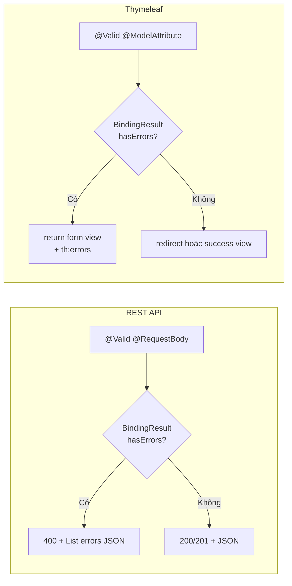
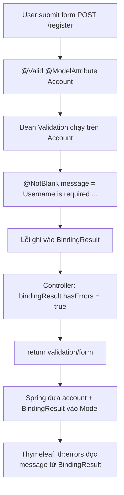
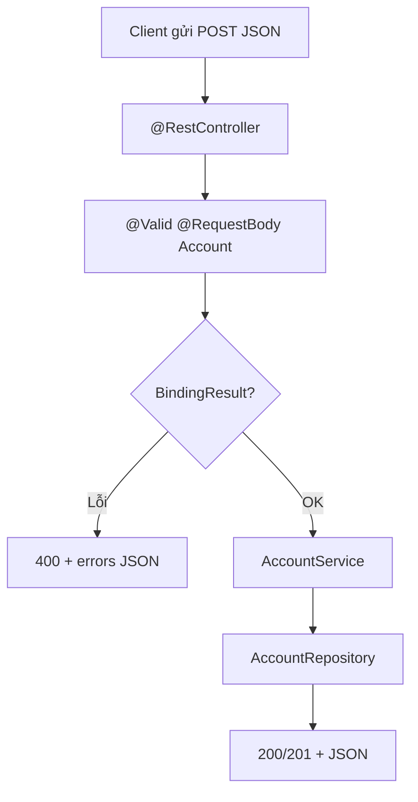
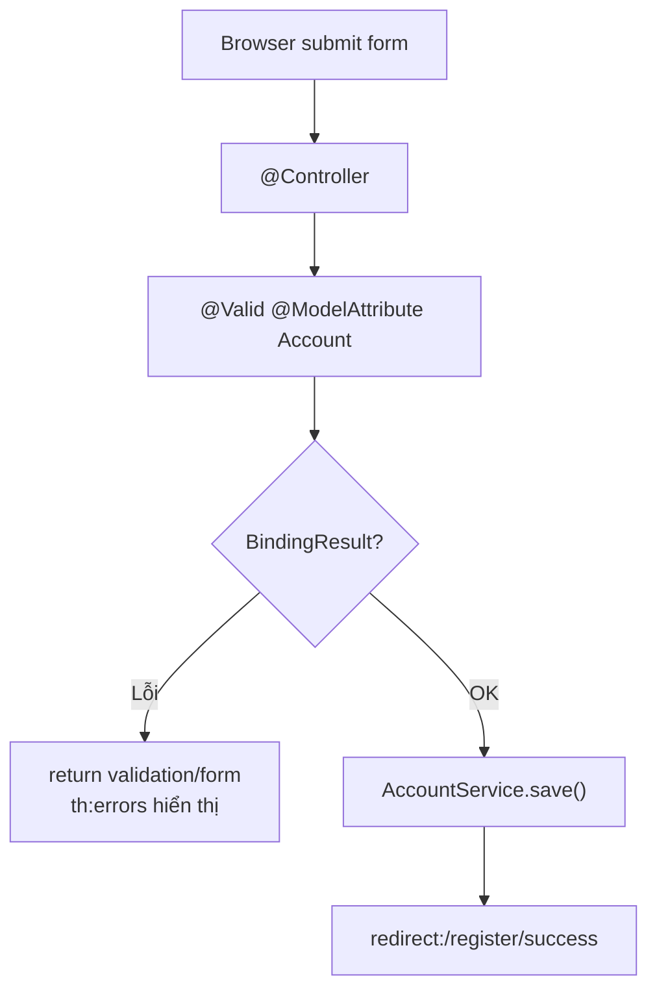

# Bài 6: Spring Boot MVC (part 2) — Service Layer, Validation, Lombok & HTTP Header

## Mục tiêu bài học

Sau bài này, học viên có thể:

- Giải thích vai trò **Service layer** trong mô hình MVC và tách business logic khỏi Controller
- Tạo Service với `@Service`, inject dependency bằng **constructor injection** (khuyến nghị) hoặc `@Autowired`
- Gọi liên thông giữa nhiều Service trong cùng project
- Dùng **Lombok** để giảm boilerplate (getter/setter, constructor)
- Validate dữ liệu đầu vào bằng **Bean Validation** — phân biệt hai luồng: **REST API (JSON)** và **Spring MVC + Thymeleaf (form HTML)**
- Nhóm API trong Controller bằng `@RequestMapping` ở class level
- Đọc HTTP Header với `@RequestHeader`

## Điều kiện tiên quyết

- Đã hoàn thành **Bài 4**: `@Controller`, Thymeleaf, `Model`, luồng render HTML
- Đã hoàn thành **Bài 5 (part 1)**: `@RestController`, `@RequestBody`, `ResponseEntity`, HTTP status code
- Biết Java cơ bản: class, package, annotation
- Project có dependency **`spring-boot-starter-web`**
- Đã cài **Postman** (cho phần REST API): [postman.com/downloads](https://www.postman.com/downloads/)

> **Ghi chú:** Khóa học dạy **song song** REST API và Thymeleaf. Bài này áp dụng cùng một bộ annotation validation (`@NotBlank`, `@Email`, …) cho **cả hai luồng**, nhưng cách xử lý lỗi và trả kết quả **khác nhau** — phần Validation được tách rõ ở mục 5 và 6.

## Nội dung

| # | Chủ đề |
|---|--------|
| 1 | Kiến trúc 3 tầng: Controller → Service → Repository |
| 2 | Quản lý Service (`@Service`, DI) |
| 3 | Gọi liên thông giữa các Service |
| 4 | Lombok |
| 5 | Validation — phần chung (annotation & dependency) |
| 6 | Validation cho REST API |
| 7 | Validation cho Spring MVC + Thymeleaf |
| 8 | Nhóm API trong Controller (`@RequestMapping`) |
| 9 | HTTP Header trong API |
| 10 | Lỗi thường gặp |
| Phụ lục | Bài tập tổng hợp · Liên kết tham khảo |

---

## 1. Kiến trúc 3 tầng: Controller → Service → Repository

Trong mô hình MVC nói chung, **Service** là lớp trung gian giữa **Controller** và **Model/Repository**, chịu trách nhiệm **business logic** (nghiệp vụ).

| Tầng | Vai trò | Ví dụ |
|------|---------|-------|
| **Controller** | Nhận HTTP request, trả response (JSON hoặc HTML) | `AccountController`, `ProductController` |
| **Service** | Xử lý logic nghiệp vụ, điều phối nhiều nguồn dữ liệu | `AccountService`, `OrderService` |
| **Repository** | Truy cập database *(học chi tiết ở bài JPA)* | `AccountRepository` |

**Ưu điểm tách Service:**

- Tách logic khỏi Controller — Controller chỉ điều phối
- Một Service có thể dùng cho nhiều Controller
- Dễ mở rộng, bảo trì, unit test
- Service có thể gọi Service khác trong cùng project

```mermaid
flowchart TD
    Client["Client / Postman / Browser"] -->|HTTP Request| C["Controller"]
    C -->|@Valid DTO / Form| V["Bean Validation"]
    V -->|OK| S["@Service — Business Logic"]
    V -->|Fail REST| ER["400 JSON + errors"]
    V -->|Fail Thymeleaf| ET["Trả lại form + hiển thị lỗi"]
    S --> R["@Repository"]
    S --> S2["Service khác"]
    R --> DB[(Database)]
```

**Ví dụ hệ thống Online Shopping:**

```
Controllers
    ├── ProductController  → ProductService  → Product DB
    ├── AccountController → AccountService  → Account DB
    ├── CartController    → CartService
    └── OrderController   → OrderService    → Order DB
                              ↑
                    AccountService có thể gọi OrderService
```

### Cấu trúc package gợi ý

Project demo bài này **chia package theo từng phần (feature-based)** — mỗi phần demo nằm trong một package riêng, bên trong vẫn tách lớp `controller` / `service` / `model` / `repository`. Cách này giúp nhìn package là biết đang demo cho mục nào.

```
src/main/java/vn/demo/
├── DemoBai6SpringmvcApplication.java
├── servicelayer/        ← mục 1-3: @Service, DI, gọi liên thông Service
│   ├── controller/      ← AccountController
│   ├── service/         ← AccountService, OrderService
│   ├── repository/      ← AccountRepository (bài JPA — tạm thời có thể bỏ qua)
│   └── model/           ← Account
├── validation/          ← mục 5-7: Bean Validation cho REST + Thymeleaf
│   ├── controller/      ← FormApiController, RegisterController
│   └── model/           ← Account (có annotation validation)
├── grouping/            ← mục 8: nhóm API bằng @RequestMapping
│   └── controller/      ← DemoController
├── header/              ← mục 9: đọc HTTP Header bằng @RequestHeader
│   └── controller/      ← ProductController
└── homework/            ← phụ lục: bài tập tổng hợp
    ├── controller/      ← ProductController, BookApiController, BookWebController, MeController
    ├── service/         ← ProductService, BookService
    ├── model/           ← Book
    └── dto/             ← BookRequest, MeResponse
```

> **Lombok** (mục 4) là kỹ thuật xuyên suốt — dùng trong mọi package (`@Data`, `@RequiredArgsConstructor`), không tách riêng.

---

## 2. Quản lý Service (`@Service`, DI)

### 2.1. Tạo Service

- `@Service` là annotation **cấp class** — khai báo class này thuộc tầng Service, do Spring quản lý vòng đời (IoC container).
- Đặt tên theo mẫu `<ĐốiTượng>Service` (ví dụ `AccountService`, `OrderService`).

```java
package vn.demo.servicelayer.service;

import vn.demo.servicelayer.model.Account;
import vn.demo.servicelayer.repository.AccountRepository;
import org.springframework.stereotype.Service;

@Service
public class AccountService {

    private final AccountRepository accountRepository;

    public AccountService(AccountRepository accountRepository) {
        this.accountRepository = accountRepository;   // constructor injection — khuyến nghị
    }

    public Account findAnyAccountByName(String name) {
        return accountRepository.findByName(name);
    }

    public Boolean validEmailFormat(String emailAddress) {
        String emailPattern = "^(?=.{1,64}@)[A-Za-z0-9_-]+(\\.[A-Za-z0-9_-]+)*@[^-][A-Za-z0-9-]+(\\.[A-Za-z0-9-]+)*(\\.[A-Za-z]{2,})$";
        return java.util.regex.Pattern.compile(emailPattern)
                .matcher(emailAddress)
                .matches();
    }
}
```

> **Lưu ý về Repository:** `AccountRepository` là tầng truy cập dữ liệu — sẽ học chi tiết ở bài **Spring Data JPA**. Ở bài này chỉ cần hiểu: **Controller không gọi DB trực tiếp; Service gọi Repository**.

### 2.2. Inject Service vào Controller — không dùng `new`

Controller **không tự tạo** Service bằng `new`. Spring đã đăng ký mọi class `@Service` trong IoC container — ta chỉ cần **khai báo dependency** và để Spring **inject** vào.

#### ❌ Sai: `new` thủ công

```java
@RestController
@RequestMapping("/api/account")
public class AccountController {

    @PostMapping("/signUp")
    public ResponseEntity<Boolean> signUpAccount(@RequestParam String emailAddress) {
        AccountService accountService = new AccountService();   // SAI
        Boolean isValidEmail = accountService.validEmailFormat(emailAddress);
        return ResponseEntity.ok(isValidEmail);
    }
}
```

| Vấn đề | Hậu quả |
|--------|---------|
| Object tạo bằng `new` | Spring **không quản lý** — ngoài IoC container |
| Mất DI | `accountRepository` bên trong `AccountService` **không được inject** → `NullPointerException` |
| Mỗi lần gọi API tạo object mới | Lãng phí bộ nhớ; mất lợi ích singleton của Spring |
| Khó test | Không thể thay `AccountService` bằng mock trong unit test |

#### Hai cách inject đúng — Spring tự cấp `AccountService`

| | Field injection | Constructor injection *(khuyến nghị)* |
|---|-----------------|--------------------------------------|
| **Cú pháp** | `@Autowired` trên field | Tham số constructor (hoặc `@RequiredArgsConstructor`) |
| **Field `final`** | Không dùng được | Dùng được — dependency bất biến |
| **Thấy rõ dependency** | Ẩn trong class | Liệt kê ngay trên constructor |
| **Unit test** | Cần reflection hoặc Spring context | `new Controller(mockService)` — không cần Spring |
| **Khuyến nghị** | Vẫn chạy được, nhưng không nên dùng làm mặc định | **Chuẩn trong Spring Boot và doanh nghiệp** |

**Cách 1 — Field injection**

```java
@RestController
@RequestMapping("/api/account")
public class AccountController {

    @Autowired
    AccountService accountService;   // Spring inject qua reflection — hoạt động, nhưng không khuyến nghị

    @PostMapping("/signUp")
    public ResponseEntity<Boolean> signUpAccount(@RequestParam String emailAddress) {
        return ResponseEntity.ok(accountService.validEmailFormat(emailAddress));
    }
}
```

**Cách 2 — Constructor injection** *(nên dùng)*

```java
@RestController
@RequestMapping("/api/account")
public class AccountController {

    private final AccountService accountService;

    // Spring 4.3+: chỉ cần 1 constructor → không bắt buộc ghi @Autowired
    public AccountController(AccountService accountService) {
        this.accountService = accountService;
    }

    @PostMapping("/signUp")
    public ResponseEntity<Boolean> signUpAccount(@RequestParam String emailAddress) {
        return ResponseEntity.ok(accountService.validEmailFormat(emailAddress));
    }
}
```

**Vì sao ưu tiên Constructor injection?**

1. **Dependency bắt buộc, rõ ràng** — Muốn tạo `AccountController` phải truyền `AccountService`. Không tồn tại controller “thiếu service” vì field chưa được inject.
2. **Field `final`** — Gán một lần trong constructor, không bị gán lại; object luôn ở trạng thái hợp lệ.
3. **Dễ unit test** — Trong test: `new AccountController(mockAccountService)` mà không cần khởi động Spring context hay dùng reflection.
4. **Phù hợp convention hiện đại** — Spring Boot, Spring Framework và hầu hết code review doanh nghiệp đều ưu tiên constructor injection.
5. **Tương thích Lombok** — `@RequiredArgsConstructor` tự sinh constructor cho mọi field `final` — code gọn mà vẫn đúng chuẩn:

```java
@RestController
@RequestMapping("/api/account")
@RequiredArgsConstructor
public class AccountController {

    private final AccountService accountService;

    @PostMapping("/signUp")
    public ResponseEntity<Boolean> signUpAccount(@RequestParam String emailAddress) {
        return ResponseEntity.ok(accountService.validEmailFormat(emailAddress));
    }
}
```

> **Ghi nhớ:** Mọi class `@Service` do Spring quản lý vòng đời (singleton mặc định). Controller/Service khác **chỉ khai báo dependency** — không `new`.

### 2.3. Phân tách trách nhiệm: Validation format vs Business rule

| Loại kiểm tra | Nên đặt ở đâu | Ví dụ |
|---------------|---------------|-------|
| **Format / ràng buộc cơ bản** | DTO + Bean Validation (`@Email`, `@Size`) | Email đúng format, password ≥ 6 ký tự |
| **Business rule** | Service | Email đã tồn tại trong DB, tài khoản bị khóa |

`validEmailFormat()` trong Service minh họa regex — trong thực tế nên ưu tiên `@Email` trên DTO (mục 5–7). Service chỉ xử lý rule nghiệp vụ không thể biểu diễn bằng annotation.

---

## 3. Gọi liên thông giữa các Service

Một Service có thể inject và gọi Service khác:

```java
@Service
public class OrderService {

    public List<String> getHistoricalOrders(String userId) {
        return List.of("pencil", "book", "ruler");   // demo — sau này đọc từ DB
    }
}
```

```java
@Service
@RequiredArgsConstructor   // Lombok — sinh constructor inject
public class AccountService {

    private final OrderService orderService;

    public List<String> getOrders(String userId) {
        return orderService.getHistoricalOrders(userId);
    }
}
```

```java
@RestController
@RequestMapping("/api/account")
@RequiredArgsConstructor
public class AccountController {

    private final AccountService accountService;

    @GetMapping("/orders")
    public ResponseEntity<List<String>> getOrders(@RequestParam String userId) {
        List<String> orders = accountService.getOrders(userId);
        return ResponseEntity.ok(orders);
    }
}
```

**Luồng kết nối:**

```
Controller  ←→  Service A  ←→  Service B
```

Test bằng Postman: `GET /api/account/orders?userId=1`

---

## 4. Lombok

**Lombok** là thư viện giúp giảm **boilerplate** — tự sinh getter, setter, constructor, … tại compile time.

### 4.1. Thêm dependency

```xml
<dependency>
    <groupId>org.projectlombok</groupId>
    <artifactId>lombok</artifactId>
    <optional>true</optional>
</dependency>
```

Sau đó **Reload Maven** trong IntelliJ.

### 4.2. Bật Annotation Processing trong IntelliJ

Nếu gặp lỗi `cannot find symbol getUsername()`:

1. **Settings** → **Build, Execution, Deployment** → **Compiler** → **Annotation Processors**
2. Bật **Enable annotation processing**
3. Reload project

### 4.3. So sánh có / không Lombok

**Không Lombok:**

```java
public class User {
    private Long id;

    public User() {}

    public User(Long id) {
        this.id = id;
    }

    public Long getId() { return id; }
    public void setId(Long id) { this.id = id; }
}
```

**Có Lombok:**

```java
import lombok.AllArgsConstructor;
import lombok.Data;
import lombok.NoArgsConstructor;

@Data
@NoArgsConstructor
@AllArgsConstructor
public class User {
    private Long id;
}
```

### 4.4. Các annotation thường dùng

| Annotation | Chức năng |
|------------|-----------|
| `@Getter` | Sinh getter cho field hoặc toàn class |
| `@Setter` | Sinh setter cho field hoặc toàn class |
| `@Data` | Getter + setter + `toString` + `equals` + `hashCode` |
| `@NoArgsConstructor` | Constructor không tham số |
| `@AllArgsConstructor` | Constructor với tất cả field |
| `@RequiredArgsConstructor` | Constructor chỉ cho field `final` — **dùng với DI** |
| `@Builder` | Pattern Builder tạo object |
| `@NonNull` | Null-check khi set giá trị |
| `@Value` | Immutable class — field `final`, không setter |

### 4.5. Ví dụ `@Getter` / `@Setter` từng field

```java
public class User {
    @Getter @Setter
    private String username;

    @Getter
    private String name;      // chỉ có getName(), không có setName()

    @Setter
    private String email;     // chỉ có setEmail(), không có getEmail()
}
```

### 4.6. Ví dụ `@Builder`

```java
@Builder
@AllArgsConstructor
public class User {
    private String id;
    private String address;
    private String position;
}

// Sử dụng
User user = User.builder()
        .id("123")
        .address("SG")
        .position("worker")
        .build();
```

### 4.7. Ví dụ `@NonNull` và `@Value`

```java
public class User {
    @NonNull
    private String id;
}
// user.setId(null) → NullPointerException
```

```java
@Value
public class User {
    String id;   // implicit final — không có setter
}
// user.setId("abc") → compile error
```

> **Lưu ý JPA:** Khi dùng Lombok với **Entity** (bài sau), thường cần `@NoArgsConstructor` bên cạnh `@Builder` vì JPA yêu cầu constructor không tham số.

---

## 5. Validation — phần chung (annotation & dependency)

**Validation** là kiểm tra **tính hợp lệ của dữ liệu đầu vào** trước khi xử lý nghiệp vụ — giúp hệ thống an toàn, tránh lỗi sâu trong Service/DB.

**Ví dụ khi đăng ký tài khoản:**

- `username`, `email`, `password` là bắt buộc
- Password đủ độ dài
- Email đúng định dạng

### 5.1. Thêm dependency

```xml
<dependency>
    <groupId>org.springframework.boot</groupId>
    <artifactId>spring-boot-starter-validation</artifactId>
</dependency>
```

Reload Maven sau khi thêm.

### 5.2. Annotation cơ bản (Bean Validation / Jakarta Validation)

| Annotation | Mô tả |
|------------|-------|
| `@NotNull` | Giá trị không được `null` |
| `@NotEmpty` | Chuỗi / collection / map có ít nhất 1 phần tử |
| `@NotBlank` | Chuỗi có ít nhất 1 ký tự khác khoảng trắng |
| `@Size(min, max)` | Độ dài chuỗi hoặc kích thước collection |
| `@Min(n)` / `@Max(n)` | Giá trị số ≥ n hoặc ≤ n |
| `@Email` | Chuỗi đúng định dạng email |

### 5.3. Model dùng chung cho cả REST API và Thymeleaf

```java
package vn.demo.validation.model;

import jakarta.validation.constraints.*;
import lombok.Data;

@Data
public class Account {

    @NotBlank(message = "Username is required")
    @Size(min = 3, max = 20, message = "Username must be between 3 and 20 characters")
    private String username;

    @Email(message = "Please provide a valid email address")
    @NotBlank(message = "Email is required")
    private String email;

    @NotBlank(message = "Password is required")
    @Size(min = 6, message = "Password must be at least 6 characters long")
    private String password;

    @NotNull(message = "Age is required")
    @Min(value = 18, message = "You must be at least 18 years old")
    private Integer age;   // dùng Integer (không phải int) để phân biệt "không gửi" vs "gửi 0"
}
```

> **`@Data` bắt buộc** (hoặc getter/setter thủ công): Jackson cần setter để bind JSON (`@RequestBody`); Thymeleaf cần getter/setter để bind form (`@ModelAttribute`).

### 5.4. Hai luồng validation — tổng quan

| Tiêu chí | REST API | Spring MVC + Thymeleaf |
|----------|----------|------------------------|
| **Controller** | `@RestController` | `@Controller` |
| **Nhận dữ liệu** | `@RequestBody` (JSON) | `@ModelAttribute` (form field) |
| **Kích hoạt validation** | `@Valid` trên `@RequestBody` | `@Valid` trên `@ModelAttribute` |
| **Xử lý lỗi** | Trả JSON + HTTP `400` | `return` lại tên view form |
| **Hiển thị lỗi** | Client (Postman / SPA) đọc JSON | Thymeleaf `th:errors` trên HTML |
| **Test** | Postman | Trình duyệt |



---

## 6. Validation cho REST API

### 6.1. Controller

```java
package vn.demo.validation.controller;

import vn.demo.validation.model.Account;
import jakarta.validation.Valid;
import org.springframework.http.HttpStatus;
import org.springframework.http.ResponseEntity;
import org.springframework.validation.BindingResult;
import org.springframework.validation.FieldError;
import org.springframework.web.bind.annotation.*;

import java.util.ArrayList;
import java.util.List;

@RestController
@RequestMapping("/api/form")
public class FormApiController {

    @PostMapping("/fill")
    public ResponseEntity<?> fillTheForm(
            @Valid @RequestBody Account account,
            BindingResult bindingResult
    ) {
        if (bindingResult.hasErrors()) {
            List<String> errors = new ArrayList<>();
            for (FieldError error : bindingResult.getFieldErrors()) {
                errors.add(error.getDefaultMessage());
            }
            return ResponseEntity.status(HttpStatus.BAD_REQUEST).body(errors);
        }
        // TODO: gọi AccountService xử lý đăng ký
        return ResponseEntity.ok().build();
    }
}
```

### 6.2. Test bằng Postman

| Bước | Thiết lập |
|------|-----------|
| Method | `POST` |
| URL | `http://localhost:8080/api/form/fill` |
| Headers | `Content-Type: application/json` |
| Body | raw → JSON |

**Body hợp lệ:**

```json
{
  "username": "john_doe",
  "email": "john@example.com",
  "password": "secret123",
  "age": 25
}
```

→ Response `200 OK`

**Body không hợp lệ** (thiếu email, password ngắn):

```json
{
  "username": "ab",
  "email": "not-an-email",
  "password": "123",
  "age": 15
}
```

→ Response `400 Bad Request`:

```json
[
  "Username must be between 3 and 20 characters",
  "Please provide a valid email address",
  "Password must be at least 6 characters long",
  "You must be at least 18 years old"
]
```

### 6.3. Lưu ý khi validate REST API

| Điểm | Giải thích |
|------|------------|
| **`BindingResult` ngay sau `@Valid`** | Tham số `BindingResult` phải đứng **liền kề** sau object được `@Valid` |
| **HTTP status** | Dữ liệu sai → `400 Bad Request`, không trả `200` kèm lỗi |
| **Cấu trúc lỗi** | Demo trả `List<String>`; production có thể chuẩn hóa `{ "field": "email", "message": "..." }` |
| **Global handler** *(nâng cao)* | Dùng `@ControllerAdvice` + `@ExceptionHandler(MethodArgumentNotValidException.class)` để gom xử lý lỗi validation cho mọi API — tránh lặp `if (bindingResult.hasErrors())` |

---

## 7. Validation cho Spring MVC + Thymeleaf

Với **form HTML**, luồng khác REST API: không trả JSON lỗi mà **render lại trang form** và hiển thị message bên cạnh từng field.

### 7.1. Controller

```java
package vn.demo.validation.controller;

import vn.demo.validation.model.Account;
import jakarta.validation.Valid;
import org.springframework.stereotype.Controller;
import org.springframework.ui.Model;
import org.springframework.validation.BindingResult;
import org.springframework.web.bind.annotation.*;

@Controller
@RequestMapping("/register")
public class RegisterController {

    @GetMapping
    public String showForm(Model model) {
        model.addAttribute("account", new Account());   // object rỗng cho form
        return "validation/form";
    }

    @PostMapping
    public String submitForm(
            @Valid @ModelAttribute("account") Account account,
            BindingResult bindingResult
    ) {
        if (bindingResult.hasErrors()) {
            return "validation/form";   // quay lại form — Thymeleaf hiển thị lỗi
        }
        // TODO: gọi AccountService lưu tài khoản
        return "redirect:/register/success";   // Post-Redirect-Get pattern
    }

    @GetMapping("/success")
    public String success() {
        return "validation/success";
    }
}
```

**So sánh với REST API:**

| REST API | Thymeleaf |
|----------|-----------|
| `@RestController` | `@Controller` |
| `@RequestBody Account` | `@ModelAttribute("account") Account` |
| `return ResponseEntity.badRequest().body(errors)` | `return "validation/form"` |
| Client đọc JSON lỗi | Browser hiển thị HTML lỗi |

### 7.2. Dữ liệu lỗi hiển thị trên form đến từ đâu?

Trước khi xem template, cần nắm **chuỗi dữ liệu** — đây là cơ sở để `th:errors` biết hiển thị gì:



| Bước | Ai xử lý | Điều gì xảy ra |
|------|----------|----------------|
| 1 | `@Valid` | Kích hoạt Bean Validation trên object `Account` |
| 2 | Annotation trên field | Ví dụ `@NotBlank(message = "Username is required")` — nếu fail, tạo `FieldError` với `defaultMessage` = chuỗi trong `message` |
| 3 | `BindingResult` | Spring gom tất cả `FieldError` vào đây *(tham số ngay sau `@Valid`)* |
| 4 | Controller | `return "validation/form"` — **không cần** tự `model.addAttribute("errors", ...)` |
| 5 | Spring MVC | Tự đưa `BindingResult` vào Model (key nội bộ gắn với tên `"account"`) |
| 6 | Thymeleaf | `#fields` và `th:errors` đọc `BindingResult` → in ra đúng `message` đã khai báo trên annotation |

**Nguồn text hiển thị** — ví dụ username trống → trên màn hình hiện **`Username is required`**, lấy từ:

```java
@NotBlank(message = "Username is required")   // ← đây là nguồn message
private String username;
```

**Không phải** text tĩnh trong thẻ HTML. Chuỗi `"Username error"` trong ví dụ cũ (nếu có) chỉ là **placeholder khi mở file HTML trực tiếp** — khi server render bằng Thymeleaf, `th:errors` **thay thế** nội dung thẻ bằng message thật từ `BindingResult`.

### 7.3. Template Thymeleaf — `templates/validation/form.html`

```html
<!DOCTYPE html>
<html xmlns:th="http://www.thymeleaf.org">
<head>
    <meta charset="UTF-8"/>
    <title>Đăng ký tài khoản</title>
    <style>
        .error { color: red; font-size: 0.9em; }
    </style>
</head>
<body>
<h1>Đăng ký tài khoản</h1>

<form th:action="@{/register}" th:object="${account}" method="post">
    <div>
        <label>Username:</label>
        <input type="text" th:field="*{username}"/>
        <!-- th:errors: in message từ BindingResult; th:if: chỉ render thẻ khi có lỗi -->
        <p class="error" th:if="${#fields.hasErrors('username')}" th:errors="*{username}"></p>
    </div>

    <div>
        <label>Email:</label>
        <input type="email" th:field="*{email}"/>
        <p class="error" th:if="${#fields.hasErrors('email')}" th:errors="*{email}"></p>
    </div>

    <div>
        <label>Password:</label>
        <input type="password" th:field="*{password}"/>
        <p class="error" th:if="${#fields.hasErrors('password')}" th:errors="*{password}"></p>
    </div>

    <div>
        <label>Age:</label>
        <input type="number" th:field="*{age}"/>
        <p class="error" th:if="${#fields.hasErrors('age')}" th:errors="*{age}"></p>
    </div>

    <button type="submit">Đăng ký</button>
</form>
</body>
</html>
```

**Giải thích chi tiết**:

- `th:errors="*{username}"` là phần **thực sự hiển thị lỗi** — đọc từ `BindingResult`, không đọc text bên trong thẻ HTML.
- Text kiểu `Username error` bên trong `<p>...</p>` **không phải** message validation — Thymeleaf ghi đè khi render. Nên để thẻ **rỗng** như ví dụ trên để học viên không tưởng đó là message cấu hình.
- `th:if` và `th:errors` dùng **cùng một nguồn** (`BindingResult`); `th:if` tránh render thẻ `<p>` trống khi field hợp lệ. Có thể chỉ dùng `th:errors` (không có lỗi thì không in gì), nhưng thẻ wrapper vẫn có thể còn — `th:if` giúp HTML gọn hơn.

**Điều kiện để hoạt động đúng (checklist):**

- [ ] `th:object="${account}"` khớp tên `@ModelAttribute("account")`
- [ ] Model class có annotation `message = "..."` trên từng constraint
- [ ] Controller có `BindingResult` **ngay sau** tham số `@Valid`
- [ ] Khi lỗi, controller `return` lại **cùng view form** (không `redirect` — redirect làm mất `BindingResult`)

### 7.4. Template thành công — `templates/validation/success.html`

```html
<!DOCTYPE html>
<html xmlns:th="http://www.thymeleaf.org">
<head>
    <meta charset="UTF-8"/>
    <title>Đăng ký thành công</title>
</head>
<body>
<h1>Đăng ký thành công!</h1>
<p><a th:href="@{/register}">Quay lại form</a></p>
</body>
</html>
```

### 7.5. Test trên trình duyệt

1. Mở `http://localhost:8080/register`
2. Submit form trống hoặc dữ liệu sai → trang form hiện lại kèm message đỏ
3. Submit hợp lệ → redirect sang `/register/success`

> **Post-Redirect-Get:** Sau POST thành công, dùng `redirect:` thay vì `return "success"` trực tiếp — tránh user bấm F5 gửi lại form (đã học ở Bài 4).

---

## 8. Nhóm API trong Controller (`@RequestMapping`)

**Mục đích:** Gom các API cùng prefix URL vào một Controller — code gọn, dễ quản lý.

```java
@RestController
@RequestMapping("/api/demo")
public class DemoController {

    @DeleteMapping("/order/detail")
    public ResponseEntity<String> deleteOrder(@RequestParam String id) {
        System.out.println("Id value: " + id);
        return ResponseEntity.ok(id);
    }

    @GetMapping("/order/list")
    public ResponseEntity<List<String>> listOrders() {
        return ResponseEntity.ok(List.of("order-1", "order-2"));
    }
}
```

| Method mapping | URL đầy đủ |
|----------------|------------|
| `@DeleteMapping("/order/detail")` | `DELETE /api/demo/order/detail` |
| `@GetMapping("/order/list")` | `GET /api/demo/order/list` |

> **Lưu ý:** Không thêm dấu `/` thừa ở cuối `@RequestMapping("/api/demo/")` — nên dùng `/api/demo` để tránh double slash.

---

## 9. HTTP Header trong API

**HTTP Header** là phần metadata của request/response — chứa thông tin vận hành (host, content-type, user-agent) hoặc **thông tin nghiệp vụ chung** (token, user ID, request ID).

### 9.1. Đọc toàn bộ header

```java
@RestController
public class ProductController {

    @GetMapping("/products")
    public ResponseEntity<Map<String, String>> getAllProducts(
            @RequestHeader Map<String, String> headers
    ) {
        System.out.println(headers);
        return ResponseEntity.ok(headers);
    }
}
```

### 9.2. Đọc header cụ thể

```java
@GetMapping("/profile")
public ResponseEntity<String> getProfile(
        @RequestHeader("Authorization") String authorization,
        @RequestHeader(value = "X-Request-Id", required = false) String requestId
) {
    // TODO: validate token trong Service — không làm ở Controller
    return ResponseEntity.ok("Profile data");
}
```

| Tham số | Ý nghĩa |
|---------|---------|
| `@RequestHeader("Authorization")` | Bắt buộc — thiếu sẽ lỗi 400 |
| `required = false` | Header tùy chọn — không có thì giá trị `null` |

### 9.3. Test bằng Postman

1. Tạo request `GET /products`
2. Tab **Headers** → thêm `Authorization: Bearer demo-token`, `X-Custom-Id: 123`
3. Quan sát response / console

> **Bảo mật:** Không `System.out.println` token thật trong production. Xác thực token sẽ học ở bài **Spring Security**.

---

## 10. Lỗi thường gặp

| Triệu chứng | Nguyên nhân | Cách xử lý |
|-------------|-------------|------------|
| **`NullPointerException` trong Service** | `new AccountService()` thay vì inject | Dùng `@Autowired` hoặc constructor injection |
| **Validation không chạy** | Thiếu `@Valid` | Thêm `@Valid` trước `@RequestBody` / `@ModelAttribute` |
| **Validation không chạy** | Thiếu dependency `spring-boot-starter-validation` | Thêm vào `pom.xml`, reload Maven |
| **`@RequestBody` nhận null** | DTO thiếu getter/setter | Thêm `@Data` (Lombok) hoặc getter/setter thủ công |
| **Form Thymeleaf không giữ giá trị khi lỗi** | Thiếu `th:field` | Dùng `th:field="*{fieldName}"` thay vì `name=` thuần |
| **Lỗi không hiện trên HTML** | Thiếu `th:errors` | Thêm `th:errors="*{field}"` và `th:object` |
| **`BindingResult` không hoạt động** | Thứ tự tham số sai | `BindingResult` phải ngay sau parameter `@Valid` |
| **`int` age luôn fail @Min** | Client không gửi `age` → mặc định `0` | Dùng `Integer` + `@NotNull` |
| **Lombok lỗi compile** | Chưa bật Annotation Processing | Bật trong IntelliJ Settings |
| **404 khi gọi API** | Thiếu `@RestController` | Thêm `@RestController` cho API trả JSON |
| **Header bắt buộc bị 400** | Thiếu header trong request | Thêm header hoặc đặt `required = false` |

---

## Tóm tắt

| Khái niệm | Ý chính |
|-----------|---------|
| **Service layer** | Business logic giữa Controller và Repository |
| **`@Service`** | Khai báo class do Spring quản lý — không `new` thủ công |
| **Constructor injection** | Cách inject dependency khuyến nghị — dùng `@RequiredArgsConstructor` |
| **Lombok `@Data`** | Giảm getter/setter — cần cho `@RequestBody` và `@ModelAttribute` |
| **Bean Validation** | `@NotBlank`, `@Email`, `@Size`, … trên DTO/Model |
| **Validation REST** | `@Valid @RequestBody` → lỗi trả JSON `400` |
| **Validation Thymeleaf** | `@Valid @ModelAttribute` → lỗi hiển thị bằng `th:errors` |
| **`@RequestMapping` class** | Gom nhóm API cùng prefix URL |
| **`@RequestHeader`** | Đọc metadata / token từ HTTP header |

### Luồng xử lý đầy đủ (REST API)



### Luồng xử lý đầy đủ (Thymeleaf)



---

## Phụ lục

### Bài tập tổng hợp

#### Bài 1 — Service layer

1. Tạo `ProductService` với hàm `isValidPrice(double price)` — giá phải > 0
2. Tạo `ProductController` (`@RestController`) gọi Service qua constructor injection
3. API `GET /api/v1/products/validate-price?price=100` trả `true`/`false`

#### Bài 2 — Validation REST API

1. Tạo DTO `BookRequest` (`title`, `author`, `price`) với validation:
   - `title`: `@NotBlank`, `@Size(min=1, max=200)`
   - `author`: `@NotBlank`
   - `price`: `@NotNull`, `@Min(0)`
2. API `POST /api/v1/books` nhận JSON, trả `201` nếu hợp lệ, `400` + danh sách lỗi nếu không
3. Test đủ case trên Postman

#### Bài 3 — Validation Thymeleaf

1. Tạo form đăng ký sách tại `GET /books/new` (Thymeleaf)
2. `POST /books` validate `BookRequest`, hiển thị lỗi trên form nếu sai
3. Thành công → `redirect:/books/success`

#### Bài 4 — Header

1. API `GET /api/v1/me` yêu cầu header `X-User-Id`
2. Trả JSON `{ "userId": "...", "message": "Hello" }`
3. Test thiếu header → lỗi; có header → thành công

### Checklist trước khi nộp bài

- [ ] Service không dùng `new` — inject qua constructor
- [ ] DTO có `@Data` hoặc getter/setter
- [ ] Đã thêm `spring-boot-starter-validation`
- [ ] REST API: `@Valid` + xử lý `BindingResult` + status `400`
- [ ] Thymeleaf: `th:field` + `th:errors` trên form
- [ ] `@RestController` cho API, `@Controller` cho HTML
- [ ] `ResponseEntity<T>` có generic type

### Liên kết tham khảo

- [Spring Boot Validation](https://docs.spring.io/spring-boot/reference/io/validation.html)
- [Jakarta Bean Validation](https://jakarta.ee/specifications/bean-validation/3.0/)
- [Thymeleaf + Spring](https://www.thymeleaf.org/doc/tutorials/3.1/thymeleafspring.html)
- [Project Lombok](https://projectlombok.org/features/)
- [Spring `@RequestHeader`](https://docs.spring.io/spring-framework/reference/web/webmvc/mvc-controller/ann-methods/requestheader.html)
- [Bài 5 — REST API (part 1)](./java_m2_bai5_SpringMVC.md)
- [Bài 4 — Thymeleaf](./java_m2_bai4_SpringBoot.md)
