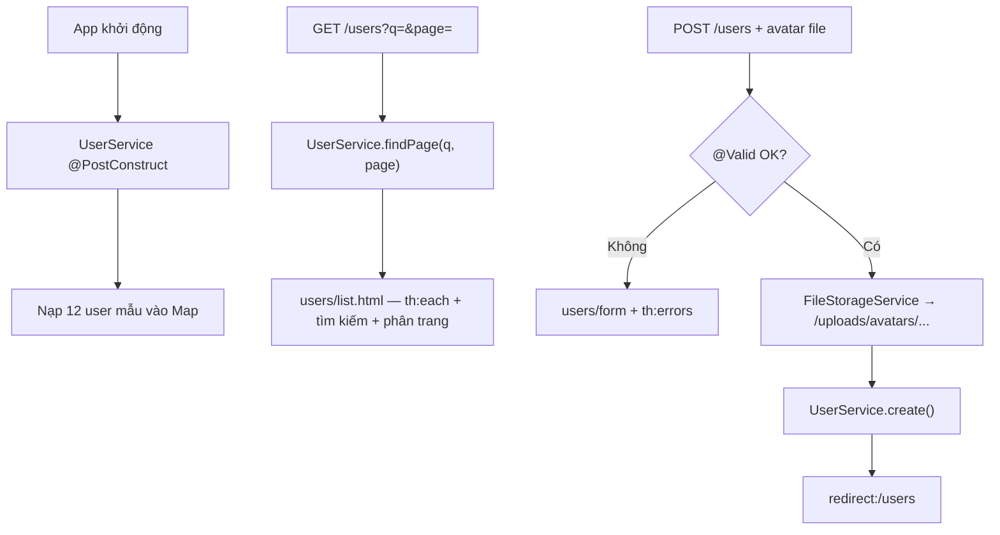
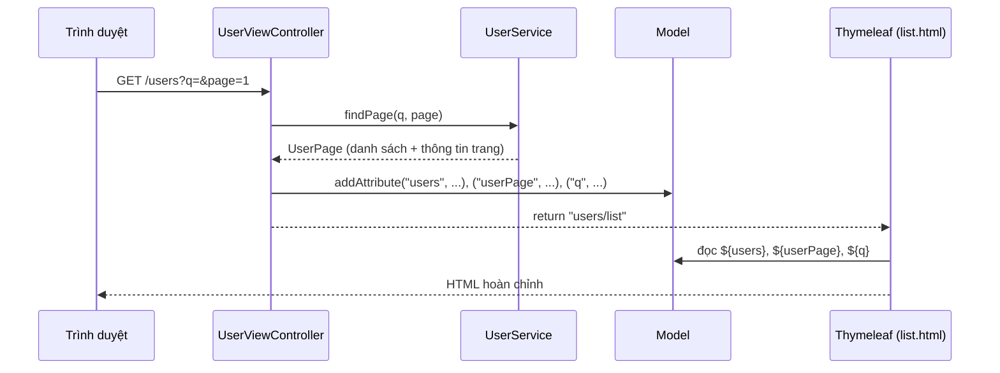

# Bài 8: Spring Boot MVC (part 3b) — Thymeleaf CRUD User + Search + Pagination + Upload Avatar

## Mục tiêu bài học

Sau bài này, học viên có thể:

- Xây dựng trang web **CRUD User** đầy đủ: danh sách, tạo, xem, sửa, xóa
- Thêm **tìm kiếm** (`?q=`) và **phân trang** (`?page=`) cho danh sách user
- Upload **avatar** qua form Thymeleaf kết hợp `MultipartFile`
- Dùng dữ liệu mẫu **hard-code trong `UserService`** (12 user) — học viên dễ hình dung, không cần External API
- Upload **avatar local** qua `FileStorageService` (đã học ở Bài 7)
- Dùng `@Controller`, `Model`, `th:each`, `th:field`, `th:errors`
- Áp dụng validation form và pattern **Post-Redirect-Get (PRG)**
- Dùng Lombok (`@Data`, `@RequiredArgsConstructor`, `@Slf4j`) và constructor injection theo chuẩn enterprise

## Điều kiện tiên quyết

- Đã hoàn thành **[Bài 7](./java_m2_bai7_SpringMVC.md)**: `FileStorageService`, `UploadResourceConfig` *(phần upload)*
- Đã hoàn thành **Bài 4**: `@Controller`, Thymeleaf, `Model`, `return "template"`
- Đã hoàn thành **Bài 6**: `@Valid`, `@ModelAttribute`, `BindingResult`, `th:field`, `th:errors`
- Project có thêm dependency **`spring-boot-starter-thymeleaf`**, **`spring-boot-starter-validation`**, **Lombok**

```xml
<dependency>
    <groupId>org.springframework.boot</groupId>
    <artifactId>spring-boot-starter-thymeleaf</artifactId>
</dependency>
<dependency>
    <groupId>org.springframework.boot</groupId>
    <artifactId>spring-boot-starter-validation</artifactId>
</dependency>
<dependency>
    <groupId>org.projectlombok</groupId>
    <artifactId>lombok</artifactId>
    <optional>true</optional>
</dependency>
```

> **Ghi chú:** Bài này **mở rộng project Bài 7** — giữ `FileStorageService` + `UploadResourceConfig`, thêm `UserForm`, `UserPage`, `UserService`, `HomeController`, `UserViewController`, templates. **Không dùng External API** — dữ liệu test tạo sẵn trong code (package `vn.demo`).

## Nội dung

| # | Chủ đề |
|---|--------|
| 1 | Quy ước Lombok & DI *(ôn)* |
| 2 | Ôn Thymeleaf & cấu trúc View |
| 3 | Tổng quan project + luồng Controller → Service → Thymeleaf |
| 4 | Model `UserForm` & DTO `UserPage` |
| 5 | UserService — CRUD in-memory + tìm kiếm + phân trang |
| 6 | HomeController & UserViewController — CRUD + upload avatar |
| 7 | Templates HTML |
| 8 | Thực hành & checkpoint |
| 9 | Lỗi thường gặp |
| Phụ lục | Bài tập mở rộng · Checklist · Liên kết |

---

## 1. Quy ước Lombok & DI *(ôn Bài 6 + 7)*

| Layer | Annotation | Ghi chú |
|-------|------------|---------|
| **Model / DTO** | `@Data` | Getter, setter, `toString` — cần cho `@ModelAttribute` |
| **Service** | `@Service` + `@RequiredArgsConstructor` + `@Slf4j` | Inject dependency qua field `final` |
| **Controller** | `@Controller` + `@RequiredArgsConstructor` | Không `@Autowired` field |
| **Config** | `@Value` *(ôn Bài 7)* | Đọc path upload từ `application.properties` |

```java
@Slf4j
@Controller
@RequiredArgsConstructor
public class UserViewController {

    private final UserService userService;
    private final FileStorageService fileStorageService;
}
```

> `UserService` trong bài này **không inject** service khác — chỉ quản lý `Map` in-memory + dữ liệu mẫu, đọc `page-size` từ `application.properties` qua `@Value`.

---

## 2. Ôn Thymeleaf & cấu trúc View

### 2.1. `static/` vs `templates/`

| Thư mục | Chứa gì | Truy cập |
|---------|---------|----------|
| `src/main/resources/static/` | CSS, JS, ảnh icon | URL trực tiếp: `/css/users.css` |
| `src/main/resources/templates/` | HTML động (Thymeleaf) | Qua `@Controller` — **không** gõ URL file |

### 2.2. Cách render chuẩn

```java
@Controller
@RequiredArgsConstructor
@RequestMapping("/users")
public class UserViewController {

    private final UserService userService;

    @GetMapping
    public String list(
            @RequestParam(value = "q", required = false) String query,
            @RequestParam(value = "page", defaultValue = "1") int page,
            Model model
    ) {
        UserPage userPage = userService.findPage(query, page);
        model.addAttribute("userPage", userPage);
        model.addAttribute("users", userPage.getUsers());
        model.addAttribute("q", userPage.getQuery());
        return "users/list";   // → templates/users/list.html
    }
}
```

| Thành phần | Quy ước |
|------------|---------|
| Annotation | `@Controller` (không phải `@RestController`) |
| Kiểu trả về | `String` — tên template |
| Dữ liệu | `model.addAttribute("key", value)` |
| Template | `templates/users/list.html` |

### 2.3. Cú pháp Thymeleaf dùng trong bài

| Cú pháp | Mục đích |
|---------|----------|
| `xmlns:th="http://www.thymeleaf.org"` | Bắt buộc ở `<html>` |
| `th:text="${name}"` | Hiển thị biến |
| `th:src="..."` | Ảnh động |
| `th:href="@{/users/{id}(id=${u.id})}"` | Link có tham số |
| `th:each="u : ${users}"` | Lặp danh sách |
| `th:object` + `th:field` | Form binding |
| `th:errors` | Hiển thị lỗi validation |
| `th:value` | Gán giá trị input (giữ từ khóa tìm kiếm) |
| `th:classappend` | Thêm class động (đánh dấu trang hiện tại) |
| `${#numbers.sequence(1, n)}` | Sinh dãy số trang cho phân trang |
| `th:replace` | Layout chung (header/footer) |

---

## 3. Tổng quan project CRUD User

### 3.1. Các màn hình

| Màn hình | URL | Method |
|----------|-----|--------|
| Trang chủ → redirect | `/` | GET |
| Danh sách (+ tìm kiếm + phân trang) | `/users?q=&page=` | GET |
| Form tạo | `/users/new` | GET |
| Tạo mới | `/users` | POST |
| Chi tiết | `/users/{id}` | GET |
| Form sửa | `/users/{id}/edit` | GET |
| Cập nhật | `/users/{id}` | POST |
| Xóa | `/users/{id}/delete` | POST |

### 3.2. Luồng dữ liệu



### 3.3. Cách hoạt động: Controller → Service → Thymeleaf

Đây là phần **quan trọng nhất** để hiểu một request đi qua các tầng như thế nào trước khi
ra được HTML cho trình duyệt.

#### a) Các tầng và vai trò

| Tầng | Lớp trong bài | Nhiệm vụ |
|------|---------------|----------|
| **Controller** | `UserViewController` | Nhận request, gọi Service, đặt dữ liệu vào `Model`, chọn template để render |
| **Service** | `UserService` | Xử lý nghiệp vụ (CRUD, tìm kiếm, phân trang) — Controller **không** tự xử lý logic |
| **Model** | `org.springframework.ui.Model` | "Túi dữ liệu" Controller gửi sang View |
| **View (Thymeleaf)** | `templates/users/*.html` | Trộn dữ liệu từ `Model` vào HTML bằng cú pháp `th:*` |

#### b) Luồng một request (ví dụ `GET /users`)



**Diễn giải từng bước:**

1. Trình duyệt gọi `GET /users`. Spring tìm method có `@GetMapping` khớp → `list(...)`.
2. Controller gọi `userService.findPage(q, page)` để **lấy dữ liệu** (logic nằm ở Service).
3. Controller bỏ dữ liệu vào `Model`: `model.addAttribute("users", userPage.getUsers())`.
4. Controller `return "users/list"` — đây là **tên template**, không phải dữ liệu.
5. Thymeleaf mở `templates/users/list.html`, đọc các biến trong `Model` rồi render ra HTML.
6. HTML hoàn chỉnh được trả về cho trình duyệt.

#### c) Thymeleaf nhận dữ liệu từ Controller như thế nào?

- Mỗi `model.addAttribute("key", value)` tạo ra một biến tên `key` dùng được trong template.
- Trong HTML, truy cập biến bằng cú pháp `${key}`; lấy thuộc tính object bằng `${user.email}`
  (Thymeleaf tự gọi getter `getEmail()`).
- Các thuộc tính `th:*` quyết định **render dữ liệu ra chỗ nào**:

| Controller đặt vào Model | Thymeleaf đọc & render | Kết quả |
|--------------------------|------------------------|---------|
| `model.addAttribute("users", list)` | `th:each="u : ${users}"` | Lặp tạo nhiều dòng `<tr>` |
| (trong vòng lặp) | `th:text="${u.fullName}"` | Ghi họ tên vào thẻ |
| (trong vòng lặp) | `th:href="@{/users/{id}(id=${u.id})}"` | Tạo link `/users/5` |
| `model.addAttribute("q", "an")` | `th:value="${q}"` | Giữ từ khóa trong ô tìm kiếm |
| `@ModelAttribute("user")` | `th:object="${user}"` + `th:field="*{email}"` | Bind 2 chiều form ↔ object |

> **Tóm gọn:** Controller **chuẩn bị dữ liệu** và chọn view; Service **xử lý nghiệp vụ**;
> Thymeleaf chỉ **hiển thị** dữ liệu có sẵn trong `Model` bằng `th:*`. View không chứa logic nghiệp vụ.

### 3.4. Avatar — chỉ upload local

| Trường hợp | `avatarUrl` | Hiển thị |
|------------|-------------|----------|
| User mẫu chưa có ảnh | `null` | Dùng `/images/default-avatar.svg` |
| User tạo/sửa + chọn file | `/uploads/avatars/uuid.jpg` | Ảnh từ thư mục upload Bài 7 |

### 3.5. Cấu trúc project (bổ sung sau Bài 7)

```
src/main/java/vn/demo/
├── ... (giữ nguyên từ Bài 7: config/UploadResourceConfig, service/FileStorageService)
├── model/
│   └── UserForm.java                  ← MỚI
├── dto/
│   └── UserPage.java                  ← MỚI (kết quả phân trang)
├── controller/
│   ├── HomeController.java            ← MỚI (redirect / → /users)
│   └── UserViewController.java        ← MỚI
└── service/
    └── UserService.java               ← MỚI

src/main/resources/
├── application.properties             ← thêm app.users.page-size
├── static/
│   ├── css/users.css
│   └── images/default-avatar.svg      ← tuỳ chọn
└── templates/
    ├── fragments/layout.html
    └── users/
        ├── list.html
        ├── form.html
        ├── detail.html
        └── not-found.html
```

---

## 4. Model `UserForm` & DTO `UserPage`

### 4.1. `UserForm.java`

**Mục đích:** vừa là dữ liệu hiển thị, vừa là form nhập liệu cho User. Dùng Lombok `@Data` để sinh getter/setter; các annotation validation được kiểm khi controller nhận `@Valid @ModelAttribute`.

| Trường | Kiểu | Ràng buộc |
|--------|------|-----------|
| `id` | `Long` | — (do hệ thống cấp) |
| `firstName` | `String` | `@NotBlank`, `@Size(max = 50)` |
| `lastName` | `String` | `@NotBlank`, `@Size(max = 50)` |
| `email` | `String` | `@NotBlank`, `@Email` |
| `phone` | `String` | `@Size(max = 20)` |
| `avatarUrl` | `String` | — (URL ảnh, có thể null) |

- Phương thức tiện ích `getFullName()` → ghép `firstName + lastName` để hiển thị.

> **Xem code đầy đủ:** [`src/main/java/vn/demo/model/UserForm.java`](../../demo-bai8-springmvc/java-springboot-bai8/src/main/java/vn/demo/model/UserForm.java)

### 4.2. `UserPage.java` — DTO kết quả phân trang

**Mục đích:** gói gọn dữ liệu một trang danh sách để template dễ hiển thị bảng + thanh phân trang.

| Trường / Hàm | Ý nghĩa |
|--------------|---------|
| `users` | Danh sách user của **trang hiện tại** |
| `query` | Từ khóa tìm kiếm đang áp dụng |
| `page` | Số trang hiện tại (bắt đầu từ 1) |
| `pageSize` | Số user mỗi trang |
| `totalItems` | Tổng số user khớp tìm kiếm |
| `totalPages` | Tổng số trang |
| `hasPrevious()` / `hasNext()` | Có trang trước / trang sau không (cho nút « Trước / Sau ») |

> **Xem code đầy đủ:** [`src/main/java/vn/demo/dto/UserPage.java`](../../demo-bai8-springmvc/java-springboot-bai8/src/main/java/vn/demo/dto/UserPage.java)

---

## 5. UserService — CRUD in-memory + tìm kiếm + phân trang

**Mục đích:** chứa toàn bộ nghiệp vụ User. Dữ liệu test **tạo sẵn trong code** (12 user) — học viên mở `/users` là thấy ngay, không cần Internet. `pageSize` đọc từ `application.properties` (mặc định 5).

**Các thuộc tính chính:**

| Thuộc tính | Vai trò |
|------------|---------|
| `Map<Long, UserForm> store` | Kho lưu user trong RAM — mất khi restart *(học JPA sau)* |
| `AtomicLong idSequence` (=13) | Sinh id cho user mới; user mẫu chiếm id 1–12 |
| `int pageSize` | Số user/trang, lấy từ `@Value("${app.users.page-size:5}")` |

**Các hàm và mục đích:**

| Hàm | Mục đích |
|-----|----------|
| `initSampleData()` *(`@PostConstruct`)* | Nạp 12 user mẫu ngay khi app khởi động |
| `findAll()` | Lấy toàn bộ user |
| `findPage(q, page)` | Lọc theo từ khóa → cắt đúng 1 trang → trả `UserPage` |
| `findById(id)` | Tìm 1 user theo id (trả `Optional`) |
| `create(form)` | Tạo user mới + cấp id tự tăng |
| `update(id, form)` | Cập nhật user; giữ avatar cũ nếu không upload ảnh mới |
| `delete(id)` | Xóa user (ném `NoSuchElementException` nếu không có) |

**`findPage` hoạt động thế nào (tìm kiếm + phân trang):**

1. Chuẩn hóa từ khóa (bỏ khoảng trắng, null → rỗng).
2. Lọc danh sách bằng `matchesQuery` — so khớp không phân biệt hoa thường trên họ, tên, full name, email, SĐT.
3. Tính `totalPages = ceil(totalItems / pageSize)`, đưa `page` về khoảng hợp lệ.
4. Cắt `subList(fromIndex, toIndex)` để lấy đúng user của trang.
5. Đóng gói tất cả vào `UserPage` trả về cho Controller.

> **Xem code đầy đủ:** [`src/main/java/vn/demo/service/UserService.java`](../../demo-bai8-springmvc/java-springboot-bai8/src/main/java/vn/demo/service/UserService.java) *(có Javadoc giải thích từng hàm)*

---

## 6. HomeController & UserViewController — CRUD + upload avatar

### 6.0. `HomeController.java` — chuyển hướng trang chủ

**Mục đích:** mở `http://localhost:8080/` tự nhảy sang danh sách user. Chỉ có 1 hàm `home()` trả về `"redirect:/users"`.

> **Xem code đầy đủ:** [`src/main/java/vn/demo/controller/HomeController.java`](../../demo-bai8-springmvc/java-springboot-bai8/src/main/java/vn/demo/controller/HomeController.java)

### 6.1. `UserViewController.java`

**Mục đích:** nhận request HTTP, gọi `UserService` xử lý nghiệp vụ, đặt dữ liệu vào `Model` rồi trả về tên template. Class dùng `@Controller` + `@RequestMapping("/users")`, inject `UserService` và `FileStorageService` qua `@RequiredArgsConstructor`.

**Các handler:**

| Hàm | Method + URL | Mục đích | Trả về |
|-----|--------------|----------|--------|
| `list(q, page, model)` | `GET /users` | Danh sách + tìm kiếm + phân trang | `users/list` |
| `createForm(model)` | `GET /users/new` | Mở form tạo mới (form trống) | `users/form` |
| `create(...)` | `POST /users` | Validate → lưu avatar → tạo user | `redirect:/users` (hoặc `users/form` nếu lỗi) |
| `detail(id, model)` | `GET /users/{id}` | Xem chi tiết 1 user | `users/detail` / `users/not-found` |
| `editForm(id, model)` | `GET /users/{id}/edit` | Mở form sửa (đổ sẵn dữ liệu) | `users/form` / `users/not-found` |
| `update(...)` | `POST /users/{id}` | Validate → lưu avatar → cập nhật | `redirect:/users` (hoặc form/not-found) |
| `delete(id, ...)` | `POST /users/{id}/delete` | Xóa user | `redirect:/users` |

**Quy ước xử lý chung trong các handler:**

- Validate form bằng `@Valid @ModelAttribute` + `BindingResult` → có lỗi thì render lại `users/form`.
- Upload avatar (nếu có file): gọi `fileStorageService.store(avatar, "avatars")`, lỗi định dạng/IO → báo `uploadError`.
- Sau thao tác ghi thành công → `redirect` + flash message (xem mục 6.3 PRG).

> **Xem code đầy đủ:** [`src/main/java/vn/demo/controller/UserViewController.java`](../../demo-bai8-springmvc/java-springboot-bai8/src/main/java/vn/demo/controller/UserViewController.java) *(có Javadoc cho từng handler)*

### 6.2. Tìm kiếm & phân trang trong `list()`

- `@RequestParam("q")` — từ khóa tìm kiếm (tùy chọn)
- `@RequestParam(value = "page", defaultValue = "1")` — số trang, mặc định 1
- Gọi `userService.findPage(q, page)` → trả `UserPage`
- Đẩy `userPage`, `users`, `q` vào `Model` để template hiển thị bảng + ô tìm kiếm + thanh phân trang

### 6.3. Post-Redirect-Get (PRG)

Sau **create / update / delete** thành công → `return "redirect:/users"`:

- Tránh bấm F5 và submit lại form
- URL sạch trên thanh địa chỉ
- Dùng `RedirectAttributes.addFlashAttribute` để hiện message 1 lần

### 6.4. Form upload — 3 điểm bắt buộc

```html
<form method="post"
      enctype="multipart/form-data"
      th:action="..."
      th:object="${user}">
    <input type="file" name="avatar" accept="image/*"/>
</form>
```

| # | Yêu cầu |
|---|---------|
| 1 | `enctype="multipart/form-data"` |
| 2 | `name="avatar"` = `@RequestParam("avatar")` |
| 3 | `th:field` cho text — **không** dùng `th:field` cho `<input type="file">` |

---

## 7. Templates HTML

Tất cả template đặt trong `src/main/resources/templates/`. Dưới đây giữ **2 file trọng tâm để học `th:*` đầy đủ** (`layout.html` + `list.html`); các file còn lại chỉ tóm tắt và dẫn tới code thực tế.

| Template | Mục đích | `th:*` tiêu biểu |
|----------|----------|------------------|
| `fragments/layout.html` | Bố cục chung (head/header/footer) tái sử dụng | `th:fragment`, `th:replace` |
| `users/list.html` | Bảng danh sách + tìm kiếm + phân trang | `th:each`, `th:if`, `th:href`, `th:value`, `th:classappend` |
| `users/form.html` | Form tạo/sửa (dùng chung) + upload avatar | `th:object`, `th:field`, `th:errors` |
| `users/detail.html` | Trang chi tiết 1 user | `th:text`, `th:src`, `th:href` |
| `users/not-found.html` | Trang báo không tìm thấy user | (HTML tĩnh + `th:replace`) |

> **Xem toàn bộ template:** [`src/main/resources/templates/`](../../demo-bai8-springmvc/java-springboot-bai8/src/main/resources/templates)

### 7.1. `templates/fragments/layout.html`

```html
<!DOCTYPE html>
<html lang="vi" xmlns:th="http://www.thymeleaf.org">
<head th:fragment="head(title)">
    <meta charset="UTF-8"/>
    <meta name="viewport" content="width=device-width, initial-scale=1.0"/>
    <title th:text="${title}">User Management</title>
    <link rel="stylesheet" th:href="@{/css/users.css}"/>
</head>
<body>
<header th:fragment="header">
    <nav>
        <a th:href="@{/users}">Danh sách User</a>
        <a th:href="@{/users/new}">+ Thêm User</a>
    </nav>
</header>
<footer th:fragment="footer">
    <p>&copy; 2025 — Demo Spring Boot MVC (Bài 8)</p>
</footer>
</body>
</html>
```

### 7.2. `templates/users/list.html`

```html
<!DOCTYPE html>
<html lang="vi" xmlns:th="http://www.thymeleaf.org">
<head th:replace="~{fragments/layout :: head('Danh sách User')}"></head>
<body>
<header th:replace="~{fragments/layout :: header}"></header>

<main>
    <h1>Quản lý User</h1>
    <p class="success" th:if="${message}" th:text="${message}"></p>
    <p class="error" th:if="${error}" th:text="${error}"></p>

    <div class="toolbar">
        <a class="btn" th:href="@{/users/new}">+ Thêm User mới</a>

        <form class="search-form" method="get" th:action="@{/users}">
            <input type="search" name="q" placeholder="Tìm theo họ, tên, email, SĐT..."
                   th:value="${q}"/>
            <button type="submit">Tìm kiếm</button>
            <a th:if="${!#strings.isEmpty(q)}" th:href="@{/users}">Xóa bộ lọc</a>
        </form>
    </div>

    <p class="meta" th:if="${userPage.totalItems > 0}">
        Hiển thị <strong th:text="${userPage.users.size()}">5</strong> /
        <strong th:text="${userPage.totalItems}">12</strong> user
        <span th:if="${!#strings.isEmpty(q)}"> — kết quả cho "<span th:text="${q}"></span>"</span>
    </p>

    <table>
        <thead>
        <tr>
            <th>Avatar</th>
            <th>Họ tên</th>
            <th>Email</th>
            <th>Điện thoại</th>
            <th>Thao tác</th>
        </tr>
        </thead>
        <tbody>
        <tr th:each="u : ${users}">
            <td>
                
            </td>
            <td th:text="${u.fullName}">Họ tên</td>
            <td th:text="${u.email}">email</td>
            <td th:text="${u.phone}">phone</td>
            <td class="actions">
                <a th:href="@{/users/{id}(id=${u.id})}">Xem</a>
                <a th:href="@{/users/{id}/edit(id=${u.id})}">Sửa</a>
                <form th:action="@{/users/{id}/delete(id=${u.id})}" method="post">
                    <button type="submit" onclick="return confirm('Xóa user này?')">Xóa</button>
                </form>
            </td>
        </tr>
        <tr th:if="${#lists.isEmpty(users)}">
            <td colspan="5">
                <span th:if="${!#strings.isEmpty(q)}">Không tìm thấy user phù hợp.</span>
                <span th:if="${#strings.isEmpty(q)}">Chưa có user.</span>
            </td>
        </tr>
        </tbody>
    </table>

    <nav class="pagination" th:if="${userPage.totalPages > 1}">
        <a th:if="${userPage.hasPrevious()}"
           th:href="@{/users(page=${userPage.page - 1}, q=${q})}">« Trước</a>

        <a th:each="p : ${#numbers.sequence(1, userPage.totalPages)}"
           th:href="@{/users(page=${p}, q=${q})}"
           th:text="${p}"
           th:classappend="${p == userPage.page} ? ' active' : ''">1</a>

        <a th:if="${userPage.hasNext()}"
           th:href="@{/users(page=${userPage.page + 1}, q=${q})}">Sau »</a>
    </nav>
</main>

<footer th:replace="~{fragments/layout :: footer}"></footer>
</body>
</html>
```

### 7.3. `templates/users/form.html`

**Mục đích:** form dùng chung cho **tạo mới và sửa** (phân biệt qua biến `isEdit`), có upload avatar. Điểm cốt lõi là binding form ↔ object bằng `th:object` + `th:field` và hiển thị lỗi validation bằng `th:errors`.

```html
<form th:action="${isEdit} ? @{/users/{id}(id=${user.id})} : @{/users}"
      th:object="${user}"
      method="post"
      enctype="multipart/form-data">

    <!-- Mỗi field text lặp lại theo mẫu này (firstName, lastName, email, phone) -->
    <div>
        <label>Email:</label>
        <input type="email" th:field="*{email}"/>
        <p class="error" th:if="${#fields.hasErrors('email')}" th:errors="*{email}"></p>
    </div>

    <!-- File avatar KHÔNG dùng th:field; chỉ dùng name khớp @RequestParam -->
    <input type="file" name="avatar" accept="image/*"/>

    <button type="submit" th:text="${isEdit} ? 'Cập nhật' : 'Tạo mới'">Submit</button>
</form>
```

- `th:object="${user}"` gắn form với object `user` Controller đưa vào Model.
- `th:field="*{email}"` tự sinh `name`, `id`, `value` và đổ giá trị 2 chiều.
- `th:action` đổi URL theo `isEdit`: sửa → `POST /users/{id}`, tạo → `POST /users`.

> **Xem code đầy đủ (đủ 4 field + ảnh hiện tại):** [`templates/users/form.html`](../../demo-bai8-springmvc/java-springboot-bai8/src/main/resources/templates/users/form.html)

### 7.4. `templates/users/detail.html`

**Mục đích:** hiển thị chi tiết 1 user. Đọc các thuộc tính từ `${user}` bằng `th:text`, ảnh bằng `th:src` (fallback `default-avatar.svg` nếu chưa có avatar).

```html
<h1 th:text="${user.fullName}">Họ tên</h1>

<li>Email: <span th:text="${user.email}"></span></li>
```

> **Xem code đầy đủ:** [`templates/users/detail.html`](../../demo-bai8-springmvc/java-springboot-bai8/src/main/resources/templates/users/detail.html)

### 7.5. `templates/users/not-found.html`

**Mục đích:** trang thân thiện khi truy cập id không tồn tại (UX tốt hơn stack trace). Chỉ là HTML tĩnh + dùng lại layout qua `th:replace`.

> **Xem code đầy đủ:** [`templates/users/not-found.html`](../../demo-bai8-springmvc/java-springboot-bai8/src/main/resources/templates/users/not-found.html)

### 7.6. `static/css/users.css`

**Mục đích:** CSS thuần định dạng bảng, avatar tròn, toolbar tìm kiếm, thanh phân trang, form. Không ảnh hưởng logic — học viên có thể tùy biến.

> **Xem code đầy đủ:** [`static/css/users.css`](../../demo-bai8-springmvc/java-springboot-bai8/src/main/resources/static/css/users.css)

---

## 8. Thực hành & checkpoint

### 8.1. Các bước (tiếp nối project Bài 7)

1. Thêm dependencies: Thymeleaf, Validation, Lombok
2. Thêm `app.users.page-size` vào `application.properties`
3. Tạo `UserForm` → `UserPage` → `UserService` (có dữ liệu mẫu + tìm kiếm + phân trang)
4. Tạo `HomeController` + `UserViewController`
5. Tạo thư mục `templates/users/`, `templates/fragments/`, `static/css/`
6. Run app → **http://localhost:8080/users**

> **`application.properties`** (bổ sung sau Bài 7):
>
> ```properties
> spring.servlet.multipart.max-file-size=2MB
> spring.servlet.multipart.max-request-size=5MB
> app.upload.dir=${user.home}/demo-uploads
>
> # Phân trang danh sách user
> app.users.page-size=5
> ```

### 8.2. Checkpoint

- [ ] `/users` hiển thị 12 user mẫu, 5 user/trang (trang 1: Nguyễn Văn An … Hoàng Văn Em)
- [ ] User mẫu chưa có avatar → hiện `default-avatar.svg`
- [ ] Tìm `?q=trần` → chỉ hiện user khớp họ/tên/email/SĐT
- [ ] Thanh phân trang chuyển trang, giữ nguyên `q` khi tìm kiếm
- [ ] Tạo user mới + upload avatar → list có `/uploads/avatars/...`
- [ ] Submit form trống email → hiện lỗi validation trên form
- [ ] Sửa user — không chọn ảnh mới → avatar cũ vẫn giữ
- [ ] Xóa user → biến mất sau redirect
- [ ] Truy cập `/users/99999` → trang `not-found` (không stack trace)
- [ ] F5 sau khi tạo user → **không** tạo duplicate (nhờ PRG)
- [ ] Mở `/` → tự redirect sang `/users`

### 8.3. Kịch bản test gợi ý

| # | Thao tác | Kết quả mong đợi |
|---|----------|------------------|
| 1 | Mở `/users` | 5 user trang 1 / 12 user + avatar mặc định |
| 2 | Chuyển trang 2, 3 | Phân trang hoạt động, đúng user mỗi trang |
| 3 | Tìm `?q=trần` | Lọc theo tên, giữ `q` khi đổi trang |
| 4 | Thêm user id=13, upload ảnh JPG | Redirect + avatar local hiển thị |
| 5 | Sửa email user id=2, không đổi ảnh | Email đổi, avatar giữ nguyên |
| 6 | Xóa user id=13 | User biến mất khỏi list |
| 7 | Restart app | 12 user mẫu load lại; user tự tạo mất *(chưa có DB)* |

---

## 9. Lỗi thường gặp

| Triệu chứng | Nguyên nhân | Cách xử lý |
|-------------|-------------|------------|
| **`MultipartException`** | Form thiếu `enctype` | Thêm `multipart/form-data` |
| **`avatar` null** | Sai `name` input file | `name="avatar"` |
| **Ảnh upload 404** | Thiếu `UploadResourceConfig` | Kiểm tra Bài 7 mục 1.5 |
| **Template not found** | Sai tên return | `users/list` → `templates/users/list.html` |
| **`th:*` không hoạt động** | Thiếu `xmlns:th` | Thêm namespace vào `<html>` |
| **Validation không chạy** | Thiếu `@Valid` | Thêm trước `@ModelAttribute` |
| **Lỗi không hiện** | Thiếu `th:errors` | Thêm `th:if` + `th:errors` |
| **F5 tạo duplicate** | Không redirect | `return "redirect:/users"` |
| **List trống** | `initSampleData()` chưa chạy | Kiểm tra `@PostConstruct` trong `UserService` |
| **404 `/users`** | Thiếu `@Controller` | Không dùng `@RestController` cho HTML |
| **Phân trang lỗi `userPage` null** | Controller không đẩy `userPage` vào Model | Thêm `model.addAttribute("userPage", ...)` |
| **Tìm kiếm mất `q` khi đổi trang** | Link phân trang thiếu `q` | `@{/users(page=..., q=${q})}` |

---

## Tóm tắt

| Khái niệm | Ý chính |
|-----------|---------|
| **`@Controller`** | Trả tên template HTML |
| **`Model`** | Truyền dữ liệu Controller → View |
| **`th:each`** | Hiển thị danh sách |
| **`th:field` + `th:errors`** | Form + validation (Bài 6) |
| **PRG** | `redirect:` sau POST thành công |
| **Dữ liệu mẫu `@PostConstruct`** | 12 user hard-code — dễ test CRUD |
| **Tìm kiếm + phân trang** | `findPage(q, page)` → `UserPage` → `subList` |
| **Upload avatar** | `enctype` + `MultipartFile` + `FileStorageService` |
| **`not-found.html`** | UX tốt hơn stack trace |
| **`@RequiredArgsConstructor`** | Inject Service — không constructor thủ công |
| **`@Slf4j`** | Log thay `printStackTrace` |

---

## Phụ lục

### Bài tập mở rộng

1. **Xóa avatar cũ:** khi upload mới, xóa file cũ trong `FileStorageService`
2. **Sắp xếp:** thêm `?sort=name` để sắp xếp danh sách theo họ tên
3. **Chọn page-size động:** cho phép đổi số user/trang qua `?size=`

### Checklist nộp bài

- [ ] CRUD đủ 5 thao tác: list, create, detail, edit, delete
- [ ] Tìm kiếm (`?q=`) + phân trang (`?page=`) hoạt động, giữ `q` khi đổi trang
- [ ] Upload avatar hoạt động trên form Thymeleaf
- [ ] Validation hiển thị lỗi trên form
- [ ] PRG sau create/update/delete
- [ ] Trang `not-found` khi id sai
- [ ] HTML có `xmlns:th`
- [ ] `@Controller` + `@RequiredArgsConstructor` — không `@Autowired` field
- [ ] `UserService`, `UserViewController` dùng `@Slf4j`
- [ ] `HomeController` redirect `/` → `/users`

### Liên kết tham khảo

- [Thymeleaf + Spring](https://www.thymeleaf.org/doc/tutorials/3.1/thymeleafspring.html)
- [Bài 7 — Upload & External API](./java_m2_bai7_SpringMVC.md) *(Bài 8 chỉ dùng phần upload)*
- [Bài 6 — Validation Thymeleaf](./java_m2_bai6_SpringMVC.md)
- [Bài 4 — Thymeleaf cơ bản](./java_m2_bai4_SpringBoot.md)
