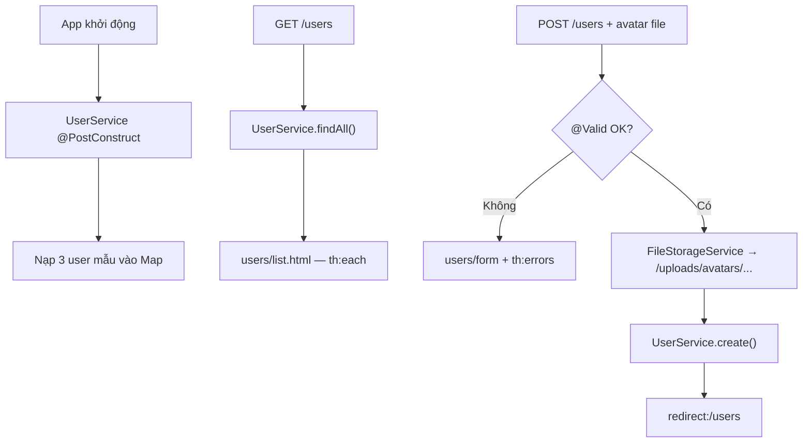

# Bài 8: Spring Boot MVC (part 3b) — Thymeleaf CRUD User + Upload Avatar

## Mục tiêu bài học

Sau bài này, học viên có thể:

- Xây dựng trang web **CRUD User** đầy đủ: danh sách, tạo, xem, sửa, xóa
- Upload **avatar** qua form Thymeleaf kết hợp `MultipartFile`
- Dùng dữ liệu mẫu **hard-code trong `UserService`** — học viên dễ hình dung, không cần External API
- Upload **avatar local** qua `FileStorageService` (đã học ở Bài 7)
- Dùng `@Controller`, `Model`, `th:each`, `th:field`, `th:errors`
- Áp dụng validation form và pattern **Post-Redirect-Get (PRG)**
- Dùng Lombok (`@Data`, `@RequiredArgsConstructor`, `@Slf4j`) và constructor injection theo chuẩn enterprise

## Điều kiện tiên quyết

- Đã hoàn thành **[Bài 7](./java_m2_bai7_SpringMVC.md)**: `FileStorageService`, `UploadResourceConfig` *(phần upload)*
- Đã hoàn thành **Bài 4**: `@Controller`, Thymeleaf, `Model`, `return "template"`
- Đã hoàn thành **Bài 6**: `@Valid`, `@ModelAttribute`, `BindingResult`, `th:field`, `th:errors`
- Project có thêm dependency **`spring-boot-starter-thymeleaf`**, **`spring-boot-starter-validation`**, **Lombok**

```xml
<dependency>
    <groupId>org.springframework.boot</groupId>
    <artifactId>spring-boot-starter-thymeleaf</artifactId>
</dependency>
<dependency>
    <groupId>org.springframework.boot</groupId>
    <artifactId>spring-boot-starter-validation</artifactId>
</dependency>
<dependency>
    <groupId>org.projectlombok</groupId>
    <artifactId>lombok</artifactId>
    <optional>true</optional>
</dependency>
```

> **Ghi chú:** Bài này **mở rộng project Bài 7** — giữ `FileStorageService` + `UploadResourceConfig`, thêm `UserForm`, `UserService`, `UserViewController`, templates. **Không dùng External API** — dữ liệu test tạo sẵn trong code.

## Nội dung

| # | Chủ đề |
|---|--------|
| 1 | Quy ước Lombok & DI *(ôn)* |
| 2 | Ôn Thymeleaf & cấu trúc View |
| 3 | Tổng quan project CRUD User |
| 4 | Model `UserForm` |
| 5 | UserService — CRUD in-memory + dữ liệu mẫu |
| 6 | UserViewController — CRUD + upload avatar |
| 7 | Templates HTML |
| 8 | Thực hành & checkpoint |
| 9 | Lỗi thường gặp |
| Phụ lục | Bài tập mở rộng · Checklist · Liên kết |

---

## 1. Quy ước Lombok & DI *(ôn Bài 6 + 7)*

| Layer | Annotation | Ghi chú |
|-------|------------|---------|
| **Model / DTO** | `@Data` | Getter, setter, `toString` — cần cho `@ModelAttribute` |
| **Service** | `@Service` + `@RequiredArgsConstructor` + `@Slf4j` | Inject dependency qua field `final` |
| **Controller** | `@Controller` + `@RequiredArgsConstructor` | Không `@Autowired` field |
| **Config** | `@Value` *(ôn Bài 7)* | Đọc path upload từ `application.properties` |

```java
@Slf4j
@Service
@RequiredArgsConstructor
public class UserViewController {

    private final UserService userService;
    private final FileStorageService fileStorageService;
}
```

> `UserService` trong bài này **không inject** service khác — chỉ quản lý `Map` in-memory + dữ liệu mẫu.

---

## 2. Ôn Thymeleaf & cấu trúc View

### 2.1. `static/` vs `templates/`

| Thư mục | Chứa gì | Truy cập |
|---------|---------|----------|
| `src/main/resources/static/` | CSS, JS, ảnh icon | URL trực tiếp: `/css/users.css` |
| `src/main/resources/templates/` | HTML động (Thymeleaf) | Qua `@Controller` — **không** gõ URL file |

### 2.2. Cách render chuẩn

```java
@Controller
@RequiredArgsConstructor
@RequestMapping("/users")
public class UserViewController {

    private final UserService userService;

    @GetMapping
    public String list(Model model) {
        model.addAttribute("users", userService.findAll());
        return "users/list";   // → templates/users/list.html
    }
}
```

| Thành phần | Quy ước |
|------------|---------|
| Annotation | `@Controller` (không phải `@RestController`) |
| Kiểu trả về | `String` — tên template |
| Dữ liệu | `model.addAttribute("key", value)` |
| Template | `templates/users/list.html` |

### 2.3. Cú pháp Thymeleaf dùng trong bài

| Cú pháp | Mục đích |
|---------|----------|
| `xmlns:th="http://www.thymeleaf.org"` | Bắt buộc ở `<html>` |
| `th:text="${name}"` | Hiển thị biến |
| `th:src="..."` | Ảnh động |
| `th:href="@{/users/{id}(id=${u.id})}"` | Link có tham số |
| `th:each="u : ${users}"` | Lặp danh sách |
| `th:object` + `th:field` | Form binding |
| `th:errors` | Hiển thị lỗi validation |
| `th:replace` | Layout chung (header/footer) |

---

## 3. Tổng quan project CRUD User

### 3.1. Các màn hình

| Màn hình | URL | Method |
|----------|-----|--------|
| Danh sách | `/users` | GET |
| Form tạo | `/users/new` | GET |
| Tạo mới | `/users` | POST |
| Chi tiết | `/users/{id}` | GET |
| Form sửa | `/users/{id}/edit` | GET |
| Cập nhật | `/users/{id}` | POST |
| Xóa | `/users/{id}/delete` | POST |

### 3.2. Luồng dữ liệu



### 3.3. Avatar — chỉ upload local

| Trường hợp | `avatarUrl` | Hiển thị |
|------------|-------------|----------|
| User mẫu chưa có ảnh | `null` | Dùng `/images/default-avatar.png` |
| User tạo/sửa + chọn file | `/uploads/avatars/uuid.jpg` | Ảnh từ thư mục upload Bài 7 |

### 3.4. Cấu trúc project (bổ sung sau Bài 7)

```
src/main/java/com/example/demo/
├── ... (giữ nguyên từ Bài 7)
├── model/
│   └── UserForm.java
├── controller/
│   └── UserViewController.java        ← MỚI
└── service/
    └── UserService.java               ← MỚI

src/main/resources/
├── application.properties             ← giữ từ Bài 7
├── static/
│   ├── css/users.css
│   └── images/default-avatar.png      ← tuỳ chọn
└── templates/
    ├── fragments/layout.html
    └── users/
        ├── list.html
        ├── form.html
        ├── detail.html
        └── not-found.html
```

---

## 4. Model — UserForm.java

```java
package com.example.demo.model;

import jakarta.validation.constraints.Email;
import jakarta.validation.constraints.NotBlank;
import jakarta.validation.constraints.Size;
import lombok.Data;
import lombok.NoArgsConstructor;

@Data
@NoArgsConstructor
public class UserForm {

    private Long id;

    @NotBlank(message = "Họ không được để trống")
    @Size(max = 50, message = "Họ tối đa 50 ký tự")
    private String firstName;

    @NotBlank(message = "Tên không được để trống")
    @Size(max = 50, message = "Tên tối đa 50 ký tự")
    private String lastName;

    @NotBlank(message = "Email không được để trống")
    @Email(message = "Email không đúng định dạng")
    private String email;

    @Size(max = 20, message = "SĐT tối đa 20 ký tự")
    private String phone;

    private String avatarUrl;

    public String getFullName() {
        return ((firstName != null ? firstName : "") + " " + (lastName != null ? lastName : "")).trim();
    }
}
```

---

## 5. UserService — CRUD in-memory + dữ liệu mẫu

Dữ liệu test **tạo sẵn trong code** — học viên mở `/users` là thấy ngay 3 user, không cần Internet.

```java
package com.example.demo.service;

import com.example.demo.model.UserForm;
import jakarta.annotation.PostConstruct;
import lombok.extern.slf4j.Slf4j;
import org.springframework.stereotype.Service;

import java.util.*;
import java.util.concurrent.atomic.AtomicLong;

@Slf4j
@Service
public class UserService {

    private final Map<Long, UserForm> store = new LinkedHashMap<>();
    private final AtomicLong idSequence = new AtomicLong(4);   // id mới bắt đầu từ 4

    @PostConstruct
    public void initSampleData() {
        addSample(1L, "Nguyễn", "Văn An", "an.nguyen@example.com", "0901111111");
        addSample(2L, "Trần", "Thị Bình", "binh.tran@example.com", "0902222222");
        addSample(3L, "Lê", "Văn Cường", "cuong.le@example.com", "0903333333");
        log.info("Initialized {} sample users for demo", store.size());
    }

    private void addSample(Long id, String firstName, String lastName, String email, String phone) {
        UserForm user = new UserForm();
        user.setId(id);
        user.setFirstName(firstName);
        user.setLastName(lastName);
        user.setEmail(email);
        user.setPhone(phone);
        // avatarUrl = null → template hiển thị default-avatar.png
        store.put(id, user);
    }

    public List<UserForm> findAll() {
        return new ArrayList<>(store.values());
    }

    public Optional<UserForm> findById(Long id) {
        return Optional.ofNullable(store.get(id));
    }

    public UserForm create(UserForm form) {
        long newId = idSequence.getAndIncrement();
        form.setId(newId);
        store.put(newId, form);
        return form;
    }

    public UserForm update(Long id, UserForm form) {
        if (!store.containsKey(id)) {
            throw new NoSuchElementException("User not found: " + id);
        }
        UserForm existing = store.get(id);
        form.setId(id);
        // Giữ avatar cũ nếu không upload ảnh mới
        if (form.getAvatarUrl() == null || form.getAvatarUrl().isBlank()) {
            form.setAvatarUrl(existing.getAvatarUrl());
        }
        store.put(id, form);
        return form;
    }

    public void delete(Long id) {
        if (!store.remove(id)) {
            throw new NoSuchElementException("User not found: " + id);
        }
    }
}
```

| Điểm quan trọng | Giải thích |
|-----------------|------------|
| `@PostConstruct` | Tự chạy khi app khởi động — nạp 3 user mẫu |
| `Map<Long, UserForm>` | Lưu tạm RAM — mất khi restart *(học JPA sau)* |
| `idSequence` từ 4 | User mẫu id 1–3; user mới id 4, 5, … |
| Giữ avatar khi update | Không chọn file mới → giữ `avatarUrl` cũ |
| Không External API | Tập trung CRUD + upload — đơn giản cho người mới |

---

## 6. UserViewController — CRUD + upload avatar

```java
package com.example.demo.controller;

import com.example.demo.model.UserForm;
import com.example.demo.service.FileStorageService;
import com.example.demo.service.UserService;
import jakarta.validation.Valid;
import lombok.RequiredArgsConstructor;
import lombok.extern.slf4j.Slf4j;
import org.springframework.stereotype.Controller;
import org.springframework.ui.Model;
import org.springframework.validation.BindingResult;
import org.springframework.web.bind.annotation.*;
import org.springframework.web.multipart.MultipartFile;
import org.springframework.web.servlet.mvc.support.RedirectAttributes;

import java.util.NoSuchElementException;

@Slf4j
@Controller
@RequiredArgsConstructor
@RequestMapping("/users")
public class UserViewController {

    private final UserService userService;
    private final FileStorageService fileStorageService;

    @GetMapping
    public String list(Model model) {
        model.addAttribute("users", userService.findAll());
        return "users/list";
    }

    @GetMapping("/new")
    public String createForm(Model model) {
        model.addAttribute("user", new UserForm());
        model.addAttribute("isEdit", false);
        return "users/form";
    }

    @PostMapping
    public String create(
            @Valid @ModelAttribute("user") UserForm user,
            BindingResult bindingResult,
            @RequestParam(value = "avatar", required = false) MultipartFile avatar,
            Model model,
            RedirectAttributes redirectAttributes
    ) {
        if (bindingResult.hasErrors()) {
            model.addAttribute("isEdit", false);
            return "users/form";
        }
        try {
            if (avatar != null && !avatar.isEmpty()) {
                user.setAvatarUrl(fileStorageService.store(avatar, "avatars"));
            }
            userService.create(user);
            redirectAttributes.addFlashAttribute("message", "Tạo user thành công!");
            log.info("Created user id={}", user.getId());
            return "redirect:/users";
        } catch (IllegalArgumentException e) {
            log.warn("Create user failed - upload: {}", e.getMessage());
            model.addAttribute("isEdit", false);
            model.addAttribute("uploadError", e.getMessage());
            return "users/form";
        }
    }

    @GetMapping("/{id}")
    public String detail(@PathVariable Long id, Model model) {
        return userService.findById(id)
                .map(user -> {
                    model.addAttribute("user", user);
                    return "users/detail";
                })
                .orElse("users/not-found");
    }

    @GetMapping("/{id}/edit")
    public String editForm(@PathVariable Long id, Model model) {
        return userService.findById(id)
                .map(user -> {
                    model.addAttribute("user", user);
                    model.addAttribute("isEdit", true);
                    return "users/form";
                })
                .orElse("users/not-found");
    }

    @PostMapping("/{id}")
    public String update(
            @PathVariable Long id,
            @Valid @ModelAttribute("user") UserForm user,
            BindingResult bindingResult,
            @RequestParam(value = "avatar", required = false) MultipartFile avatar,
            Model model,
            RedirectAttributes redirectAttributes
    ) {
        if (bindingResult.hasErrors()) {
            model.addAttribute("isEdit", true);
            return "users/form";
        }
        try {
            if (avatar != null && !avatar.isEmpty()) {
                user.setAvatarUrl(fileStorageService.store(avatar, "avatars"));
            }
            userService.update(id, user);
            redirectAttributes.addFlashAttribute("message", "Cập nhật thành công!");
            return "redirect:/users";
        } catch (NoSuchElementException e) {
            return "users/not-found";
        } catch (IllegalArgumentException e) {
            model.addAttribute("isEdit", true);
            model.addAttribute("uploadError", e.getMessage());
            return "users/form";
        }
    }

    @PostMapping("/{id}/delete")
    public String delete(@PathVariable Long id, RedirectAttributes redirectAttributes) {
        try {
            userService.delete(id);
            redirectAttributes.addFlashAttribute("message", "Đã xóa user.");
        } catch (NoSuchElementException e) {
            redirectAttributes.addFlashAttribute("error", "Không tìm thấy user.");
        }
        return "redirect:/users";
    }
}
```

### 6.1. Post-Redirect-Get (PRG)

Sau **create / update / delete** thành công → `return "redirect:/users"`:

- Tránh bấm F5 và submit lại form
- URL sạch trên thanh địa chỉ
- Dùng `RedirectAttributes.addFlashAttribute` để hiện message 1 lần

### 6.2. Form upload — 3 điểm bắt buộc

```html
<form method="post"
      enctype="multipart/form-data"
      th:action="..."
      th:object="${user}">
    <input type="file" name="avatar" accept="image/*"/>
</form>
```

| # | Yêu cầu |
|---|---------|
| 1 | `enctype="multipart/form-data"` |
| 2 | `name="avatar"` = `@RequestParam("avatar")` |
| 3 | `th:field` cho text — **không** dùng `th:field` cho `<input type="file">` |

---

## 7. Templates HTML

### 7.1. `templates/fragments/layout.html`

```html
<!DOCTYPE html>
<html lang="vi" xmlns:th="http://www.thymeleaf.org">
<head th:fragment="head(title)">
    <meta charset="UTF-8"/>
    <meta name="viewport" content="width=device-width, initial-scale=1.0"/>
    <title th:text="${title}">User Management</title>
    <link rel="stylesheet" th:href="@{/css/users.css}"/>
</head>
<body>
<header th:fragment="header">
    <nav>
        <a th:href="@{/users}">Danh sách User</a>
        <a th:href="@{/users/new}">+ Thêm User</a>
    </nav>
</header>
<footer th:fragment="footer">
    <p>&copy; 2025 — Demo Spring Boot MVC</p>
</footer>
</body>
</html>
```

### 7.2. `templates/users/list.html`

```html
<!DOCTYPE html>
<html lang="vi" xmlns:th="http://www.thymeleaf.org">
<head th:replace="~{fragments/layout :: head('Danh sách User')}"></head>
<body>
<header th:replace="~{fragments/layout :: header}"></header>

<main>
    <h1>Quản lý User</h1>
    <p class="success" th:if="${message}" th:text="${message}"></p>
    <p class="error" th:if="${error}" th:text="${error}"></p>

    <a class="btn" th:href="@{/users/new}">+ Thêm User mới</a>

    <table>
        <thead>
        <tr>
            <th>Avatar</th>
            <th>Họ tên</th>
            <th>Email</th>
            <th>Điện thoại</th>
            <th>Thao tác</th>
        </tr>
        </thead>
        <tbody>
        <tr th:each="u : ${users}">
            <td>
                
            </td>
            <td th:text="${u.fullName}">Họ tên</td>
            <td th:text="${u.email}">email</td>
            <td th:text="${u.phone}">phone</td>
            <td>
                <a th:href="@{/users/{id}(id=${u.id})}">Xem</a>
                <a th:href="@{/users/{id}/edit(id=${u.id})}">Sửa</a>
                <form th:action="@{/users/{id}/delete(id=${u.id})}" method="post" style="display:inline">
                    <button type="submit" onclick="return confirm('Xóa user này?')">Xóa</button>
                </form>
            </td>
        </tr>
        <tr th:if="${#lists.isEmpty(users)}">
            <td colspan="5">Chưa có user.</td>
        </tr>
        </tbody>
    </table>
</main>

<footer th:replace="~{fragments/layout :: footer}"></footer>
</body>
</html>
```

### 7.3. `templates/users/form.html`

```html
<!DOCTYPE html>
<html lang="vi" xmlns:th="http://www.thymeleaf.org">
<head th:replace="~{fragments/layout :: head(${isEdit} ? 'Sửa User' : 'Thêm User')}"></head>
<body>
<header th:replace="~{fragments/layout :: header}"></header>

<main>
    <h1 th:text="${isEdit} ? 'Sửa User' : 'Thêm User mới'">Form</h1>
    <p class="error" th:if="${uploadError}" th:text="${uploadError}"></p>

    <form th:action="${isEdit} ? @{/users/{id}(id=${user.id})} : @{/users}"
          th:object="${user}"
          method="post"
          enctype="multipart/form-data">

        <div>
            <label>Họ:</label>
            <input type="text" th:field="*{firstName}"/>
            <p class="error" th:if="${#fields.hasErrors('firstName')}" th:errors="*{firstName}"></p>
        </div>
        <div>
            <label>Tên:</label>
            <input type="text" th:field="*{lastName}"/>
            <p class="error" th:if="${#fields.hasErrors('lastName')}" th:errors="*{lastName}"></p>
        </div>
        <div>
            <label>Email:</label>
            <input type="email" th:field="*{email}"/>
            <p class="error" th:if="${#fields.hasErrors('email')}" th:errors="*{email}"></p>
        </div>
        <div>
            <label>Điện thoại:</label>
            <input type="text" th:field="*{phone}"/>
            <p class="error" th:if="${#fields.hasErrors('phone')}" th:errors="*{phone}"></p>
        </div>
        <div>
            <label>Avatar:</label>
            <input type="file" name="avatar" accept="image/*"/>
            <p th:if="${!#strings.isEmpty(user.avatarUrl)}">
                Ảnh hiện tại: 
            </p>
        </div>

        <button type="submit" th:text="${isEdit} ? 'Cập nhật' : 'Tạo mới'">Submit</button>
        <a th:href="@{/users}">Hủy</a>
    </form>
</main>

<footer th:replace="~{fragments/layout :: footer}"></footer>
</body>
</html>
```

### 7.4. `templates/users/detail.html`

```html
<!DOCTYPE html>
<html lang="vi" xmlns:th="http://www.thymeleaf.org">
<head th:replace="~{fragments/layout :: head('Chi tiết User')}"></head>
<body>
<header th:replace="~{fragments/layout :: header}"></header>

<main>
    <h1 th:text="${user.fullName}">Họ tên</h1>
    
    <ul>
        <li>Email: <span th:text="${user.email}"></span></li>
        <li>Điện thoại: <span th:text="${user.phone}">—</span></li>
        <li>ID: <span th:text="${user.id}"></span></li>
    </ul>
    <a th:href="@{/users/{id}/edit(id=${user.id})}">Sửa</a>
    <a th:href="@{/users}">← Quay lại</a>
</main>

<footer th:replace="~{fragments/layout :: footer}"></footer>
</body>
</html>
```

### 7.5. `templates/users/not-found.html`

```html
<!DOCTYPE html>
<html lang="vi" xmlns:th="http://www.thymeleaf.org">
<head th:replace="~{fragments/layout :: head('Không tìm thấy')}"></head>
<body>
<header th:replace="~{fragments/layout :: header}"></header>
<main>
    <h1>User không tồn tại</h1>
    <p>ID bạn truy cập không có trong hệ thống.</p>
    <a th:href="@{/users}">← Về danh sách</a>
</main>
<footer th:replace="~{fragments/layout :: footer}"></footer>
</body>
</html>
```

### 7.6. `static/css/users.css`

```css
body { font-family: Arial, sans-serif; margin: 0; padding: 0 1rem; }
nav a { margin-right: 1rem; }
table { border-collapse: collapse; width: 100%; margin-top: 1rem; }
th, td { border: 1px solid #ddd; padding: 8px; }
.avatar, .avatar-large { border-radius: 50%; object-fit: cover; }
.error { color: #c00; font-size: 0.9em; }
.success { color: #060; }
.btn { display: inline-block; margin: 1rem 0; padding: 0.5rem 1rem; background: #286CB5; color: #fff; text-decoration: none; }
```

---

## 8. Thực hành & checkpoint

### 8.1. Các bước (tiếp nối project Bài 7)

1. Thêm dependencies: Thymeleaf, Validation, Lombok
2. Tạo `UserForm` → tạo `UserService` (có dữ liệu mẫu)
3. Tạo `UserViewController`
4. Tạo thư mục `templates/users/`, `templates/fragments/`, `static/css/`
5. Run app → **http://localhost:8080/users**

### 8.2. Checkpoint

- [ ] `/users` hiển thị 3 user mẫu (Nguyễn Văn An, Trần Thị Bình, Lê Văn Cường)
- [ ] User mẫu chưa có avatar → hiện `default-avatar.png`
- [ ] Tạo user mới + upload avatar → list có `/uploads/avatars/...`
- [ ] Submit form trống email → hiện lỗi validation trên form
- [ ] Sửa user — không chọn ảnh mới → avatar cũ vẫn giữ
- [ ] Xóa user → biến mất sau redirect
- [ ] Truy cập `/users/99999` → trang `not-found` (không stack trace)
- [ ] F5 sau khi tạo user → **không** tạo duplicate (nhờ PRG)

### 8.3. Kịch bản test gợi ý

| # | Thao tác | Kết quả mong đợi |
|---|----------|------------------|
| 1 | Mở `/users` | 3 user mẫu + avatar mặc định |
| 2 | Thêm user id=4, upload ảnh JPG | Redirect + avatar local hiển thị |
| 3 | Sửa email user id=2, không đổi ảnh | Email đổi, avatar giữ nguyên |
| 4 | Xóa user id=4 | User biến mất khỏi list |
| 5 | Restart app | 3 user mẫu load lại; user tự tạo mất *(chưa có DB)* |

---

## 9. Lỗi thường gặp

| Triệu chứng | Nguyên nhân | Cách xử lý |
|-------------|-------------|------------|
| **`MultipartException`** | Form thiếu `enctype` | Thêm `multipart/form-data` |
| **`avatar` null** | Sai `name` input file | `name="avatar"` |
| **Ảnh upload 404** | Thiếu `UploadResourceConfig` | Kiểm tra Bài 7 mục 1.5 |
| **Template not found** | Sai tên return | `users/list` → `templates/users/list.html` |
| **`th:*` không hoạt động** | Thiếu `xmlns:th` | Thêm namespace vào `<html>` |
| **Validation không chạy** | Thiếu `@Valid` | Thêm trước `@ModelAttribute` |
| **Lỗi không hiện** | Thiếu `th:errors` | Thêm `th:if` + `th:errors` |
| **F5 tạo duplicate** | Không redirect | `return "redirect:/users"` |
| **List trống** | `initSampleData()` chưa chạy | Kiểm tra `@PostConstruct` trong `UserService` |
| **404 `/users`** | Thiếu `@Controller` | Không dùng `@RestController` cho HTML |

---

## Tóm tắt

| Khái niệm | Ý chính |
|-----------|---------|
| **`@Controller`** | Trả tên template HTML |
| **`Model`** | Truyền dữ liệu Controller → View |
| **`th:each`** | Hiển thị danh sách |
| **`th:field` + `th:errors`** | Form + validation (Bài 6) |
| **PRG** | `redirect:` sau POST thành công |
| **Dữ liệu mẫu `@PostConstruct`** | 3 user hard-code — dễ test CRUD |
| **Upload avatar** | `enctype` + `MultipartFile` + `FileStorageService` |
| **`not-found.html`** | UX tốt hơn stack trace |
| **`@RequiredArgsConstructor`** | Inject Service — không constructor thủ công |
| **`@Slf4j`** | Log thay `printStackTrace` |

---

## Phụ lục

### Bài tập mở rộng

1. **Tìm kiếm:** ô `?q=` trên list — lọc theo họ, tên, email
2. **Xóa avatar cũ:** khi upload mới, xóa file cũ trong `FileStorageService`
3. **Phân trang:** hiển thị 5 user/trang *(gợi ý: `subList` trên `findAll()`)*

### Checklist nộp bài

- [ ] CRUD đủ 5 thao tác: list, create, detail, edit, delete
- [ ] Upload avatar hoạt động trên form Thymeleaf
- [ ] Validation hiển thị lỗi trên form
- [ ] PRG sau create/update/delete
- [ ] Trang `not-found` khi id sai
- [ ] HTML có `xmlns:th`
- [ ] `@Controller` + `@RequiredArgsConstructor` — không `@Autowired` field
- [ ] `UserService`, `UserViewController` dùng `@Slf4j`
- [ ] `@RestController` giữ từ Bài 7

### Liên kết tham khảo

- [Thymeleaf + Spring](https://www.thymeleaf.org/doc/tutorials/3.1/thymeleafspring.html)
- [Bài 7 — Upload & External API](./java_m2_bai7_SpringMVC.md) *(Bài 8 chỉ dùng phần upload)*
- [Bài 6 — Validation Thymeleaf](./java_m2_bai6_SpringMVC.md)
- [Bài 4 — Thymeleaf cơ bản](./java_m2_bai4_SpringBoot.md)
